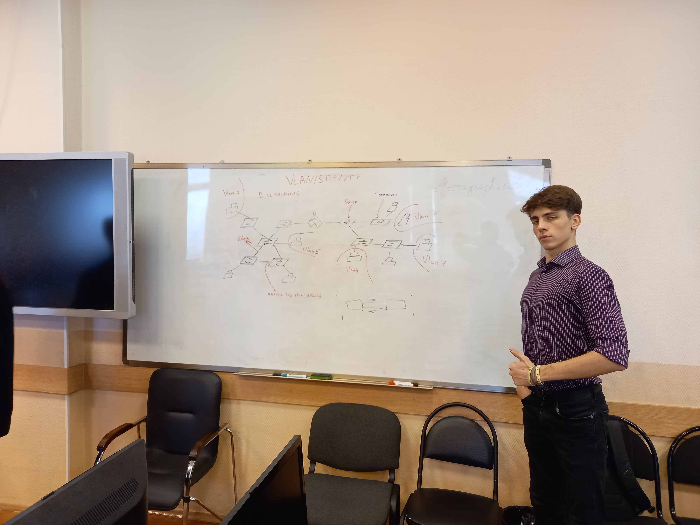
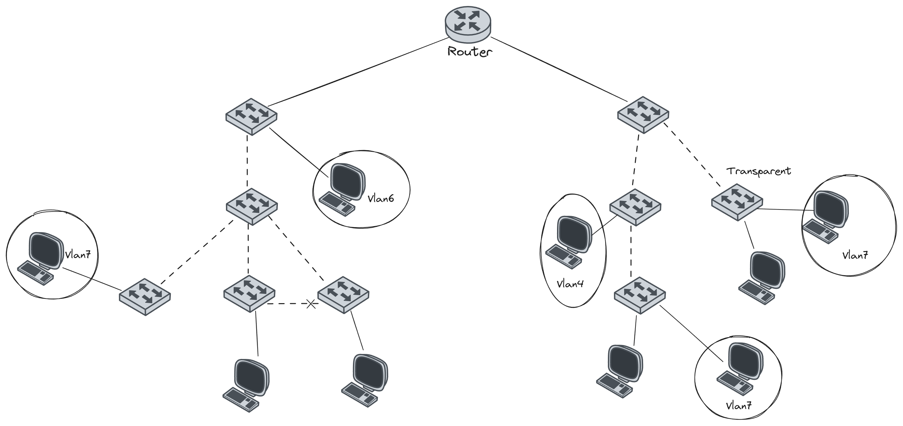

# ЛР2 - VTP/STP/VLANs

> Данная лаба построена вокруг использования протоколов VTP и STP, а также использования VLANов. 

## Условие

Дана вот такая топология. Необходимо настроить на ней VTP, STP по дефолту включен(ну точнее включен проприетарный Cisco протокол PVST), а также накидать 3 разных влана, без учета дефолтного(вроде как нативным называется). Я еще бы добавил уровень безопасности с помощью secret на уровне EXEC и самом VTP. Но это, наверное опционально. 

Топология более наглядно

## Настройка + Теория

### Теория по VLAN