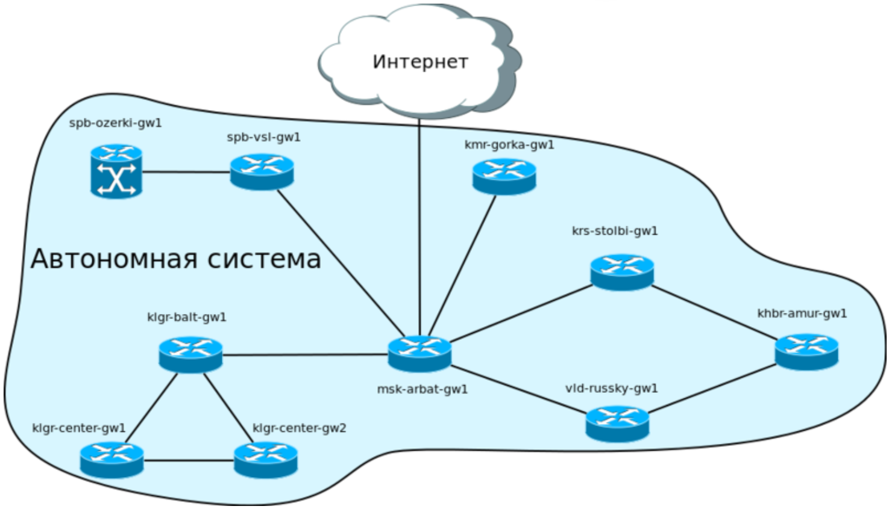
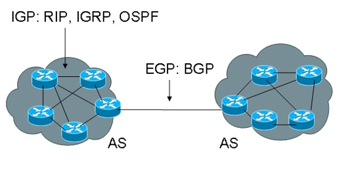

#### Две группы протоколов динамической маршрутизации

- **Внутренние** - Проктоколы внутреннего шлюза (**IGP** — Interior Gateway Protocol). Примеры протоклов внутреннего шлюза **RIP** *вставить ссылку*, [OSPF](#ospf), **EIGRP** *вставить ссылку*, **IS-IS**;

- **Внешние** - Проктоколы внешнего шлюза (**EGP** — Exterior Gateway Protocol). Примеры протоклов внешнего шлюза **BGP**.

Для лучшего понимания их различий, потребуется термин *автононная сеть*(**AS** - autonomous system). В общем смысле, автономной системой (доменом маршрутизации) называется группа роутеров, находящихся под общим управлением.



Так вот, протоколы внутренней маршрутизации используются внутри автономной системы, а внешние — для соединения автономных систем между собой.



#### Два основных класса протоколов маршруутизации

- **Дистанционно-векторные** - Distance-Vector. На регулярной основе отправляют обновления своим соседям, внутри обновления чаще всего таблица маршрутизации (таблица оптимальных маршрутов). Обновление соседа тоже пересылается. Быстрые, т.к. добавляют свои сведения в общие таблицы.

- **Состояния канала** - Link State. Отправляют обновления (не обязательно соседним маршрутизаторам), которые содержат обновления только о своих собственных каналах. Надежные, поскольку роутер верит только себе и рассказывает информации только о себе, маршрутизатор сам строит оптимальные маршруты (не на основе сформированных другими, а на основе своих сведений)

### OSPF

OSPF (Open Shortest Path First) - открытый протокол кратчайшего пути или открытый алгоритм предпочтительного выбора кратчайшего маршрута.

- Протокол сетевого уровня, но работает поверх IPv4;
- Номер протокола 89;
- Данный протокол является **протоколом динамической маршрутизации** *вставить ссылку*, а именно [протоколом внутреннего шлюза](#две-группы-протоколов-динамической-маршрутизации); 
- Основан на алгоритме Дейкстры *вставить ссылку*; 
- Использует технологию [состояния каналов](#два-основных-класса-протоколов-маршруутизации).

Краткое описание работы:

1. Когда маршрутизатор включают, он выбирает [Router ID](#терминология-ospf), либо администратор устанавливает его значение вручную.

2. Протокол ищет другие маршрутизаторы — подключенных соседей, отправляя им через определенные промежутки времени [hello-пакеты](#hello-пакет) с информацией о соседях и состоянии каналов. 

3. Если маршрутизатор получает в ответ пакет по интерфейсу, на которых активирован OSPF, то устанавливает с ним «соседские» отношения. Если не получает, маршрутизатор считает устройство «мертвым» — не отправляет ему трафик и перестраивает маршруты.

4. После того как маршрутизаторы подружились, они обмениваются [LSA-сообщениями](#терминология-ospf) о подключенных и доступных сетях, о соседском роутере и стоимости. Эти данные нужны, чтобы построить карту сети (топологию) — она пригодится для расчетов кратчайшего пути трафика. Карта одинакова на всех маршрутизаторах.

5. Маршрутизаторы синхронизируют общую базу [LSDB](#терминология-ospf), где хранят [LSA](#терминология-ospf).

6. В сети могут быть сотни или тысячи маршрутизаторов. Отправка сообщений LSA от каждого устройства к каждому обязательно забьет каналы. Чтобы этого не произошло, отправкой сообщений заведует DR: через него отправляется информация об изменениях в сети ко всем маршрутизаторам — например, когда какой-то маршрутизатор упал. Если DR не прописан изначально, то им становится маршрутизатор с самым большим IP-адресом.

7. Дальше запускается алгоритм [SPF](#терминология-ospf), который рассчитывает оптимальный маршрут к каждой сети. Процесс похож на построение дерева, где корень — маршрутизатор, а ветви — пути к доступным сетям. В общей таблице маршрутизации будут храниться лучшие пути к каждой сети.

#### Терминология OSPF

- **Идентификатор маршрутизатора** (Router ID, RID) - уникальное 32-битовое число, которое уникально идентифицирует маршрутизатор в пределах одной автономной системы;

По умолчанию OSPF в качестве RID берёт наибольший адрес на loopback интерфейсе, а если loopback интерфейс не настроен, то берётся максимальный адрес на физическом интерфейсе. Не очень корректно, когда RID зависит от физического интрефейса, поэтому нужно настроить **loopback интерфейс** - это логический интерфейс внутри маршрутизатора.

- **Обратная маска** (Wildcard mask) - маска, у которой 0 отвечает за бит сети, а 1 за бит хоста. Например, обычная маска 24 равная 255.255.255.0 теперь будет обозначаться, как 0.0.0.255. То есть если всего у IPv4 32 бита, а маска 24, значит 8 битов занято хостом, соответственно последний октет состоит из 8 едениц 0.0.0.11111111 или в десятичной 0.0.0.255;

- **Зона** (area) — совокупность сетей и маршрутизаторов, имеющих один и тот же идентификатор зоны;

- **Выделенный маршрутизатор** (Designated Router, DR) — управляет процессом рассылки LSA в сети. Каждый маршрутизатор сети устанавливает отношения смежности с DR. Информация об изменениях в сети отправляется маршрутизатором, обнаружившим это изменение, на выделенный маршрутизатор, а тот, в свою очередь, отвечает за то, чтобы эта информация была отправлена остальным маршрутизаторам сегмента множественного доступа.

Недостатком в схеме работы с DR маршрутизатором является то, что при выходе его из строя должен быть выбран новый DR. Новые отношения соседства должны быть сформированы и, пока базы данных маршрутизаторов не синхронизируются с базой данных нового DR, сеть будет недоступна для пересылки пакетов. Для устранения этого недостатка выбирается BDR.

- **Резервный выделенный маршрутизатор** (backup designated router, BDR). Каждый маршрутизатор сети устанавливает отношения соседства не только с DR, но и BDR. DR и BDR также устанавливают отношения соседства и между собой. При выходе из строя DR, BDR становится DR и выполняет все его функции. Так как маршрутизаторы сети установили отношения соседства с BDR, время недоступности сети минимизируется.

- **Объявление о состоянии канала** (Link State Advertisement, LSA) — единица данных, которая описывает локальное состояние маршрутизатора или сети. Например, для маршрутизатора LSA включает описание состояния каналов и отношений соседства. Множество всех LSA, описывающих маршрутизаторы и сети, образуют базу данных состояния каналов (LSDB);

- **База данных состояния каналов** (Link State Database, LSDB) — список всех записей о состоянии каналов (LSA). Встречается также термин топологическая база данных (topological database), употребляется как синоним базы данных состояния каналов

- **Первый кратчайший путь** (Shortest Path First, SPF) - алгоритм, который рассчитывает лучший маршрут между сетями. Данный алгоритм использует алгоритм Дейкстры.

#### Пакеты в OSPF

Всего существует 5 типов пакетов:

- [Hello](#hello-пакет) - используется для обнаружения соседе, построения отношений соседства с ними и мониторинга доступности;
- [Database Description (DBD)](#database-description-dbd) - проверяет синхронизацию базы данных между маршрутизаторами;
- [Link-State Request (LSR)](#link-state-request-lsr) - запрашивает определенные записи о состоянии каналов от маршрутизатора к маршрутизатору;
- [Link-State Update (LSU)](#link-state-update-lsu) - отправляет определенные записи о состоянии каналов в ответ на запрос;
- [Link-State Acknowledgment (LSAck)](#link-state-acknowledgment-lsack) — подтверждает получение других типов пакетов.

Все пять типов пакетов OSPF инкапсулируются непосредственно в IP-пакет. Номер протокола OSPF в IP-заголовке - 89.

У всех пакетов OSPF одинаковый заголовок. 

##### Заголовок пакета OSPF

Поля заголовка пакета OSPF:

- **Version** - версия протокола OSPF. Текущая версия для IPv4 - 2;

- **Type** - указывает какой тип пакета OSPF передается: 
    - 1 - [Hello](#hello-пакет);
    - 2 - [Database Description (DBD)](#database-description-dbd);
    - 3 - [Link-State Request (LSR)](#link-state-request-lsr);
    - 4 - [Link-State Update (LSU)](#link-state-update-lsu);
    - 5 - [Link-State Acknowledgment (LSAck)](#link-state-acknowledgment-lsack).

- **Packet length** - длина пакета OSPF в байтах. Длина включает в себя и заголовок;

- **Router ID** - [RID](#терминология-ospf) определяет какой маршрутизатор отправил пакет;

- **Area ID** - определяет в какой [зоне](#терминология-ospf) сгенерирован пакет;

- **Checksum** - контрольная сумма используется для проверки целостности пакета OSPF, для обнаружения ошибок при передаче;

- **Authentication type** - тип аутентификации, который используется между маршрутизаторами:
    - 0 — аутентификация не используется;
    - 1 — аутентификация открытым текстом;
    - 2 — MD5-аутентификация.

- **Authentication** - используется при аутентификации маршрутизаторов.

```
|<-------------------------- 32 бита --------------------------->|

+-+-+-+-+-+-+-+-+-+-+-+-+-+-+-+-+-+-+-+-+-+-+-+-+-+-+-+-+-+-+-+-+
|   Version #   |     Type      |         Packet length         |
+-+-+-+-+-+-+-+-+-+-+-+-+-+-+-+-+-+-+-+-+-+-+-+-+-+-+-+-+-+-+-+-+
|                          Router ID                            |
+-+-+-+-+-+-+-+-+-+-+-+-+-+-+-+-+-+-+-+-+-+-+-+-+-+-+-+-+-+-+-+-+
|                           Area ID                             |
+-+-+-+-+-+-+-+-+-+-+-+-+-+-+-+-+-+-+-+-+-+-+-+-+-+-+-+-+-+-+-+-+
|           Checksum            |             AuType            |
+-+-+-+-+-+-+-+-+-+-+-+-+-+-+-+-+-+-+-+-+-+-+-+-+-+-+-+-+-+-+-+-+
|                       Authentication                          |
+-+-+-+-+-+-+-+-+-+-+-+-+-+-+-+-+-+-+-+-+-+-+-+-+-+-+-+-+-+-+-+-+
|                       Authentication                          |
+-+-+-+-+-+-+-+-+-+-+-+-+-+-+-+-+-+-+-+-+-+-+-+-+-+-+-+-+-+-+-+-+
```

##### Hello-пакет

Hello-пакет в OSPF используется как форма приветствия, позволяющая маршрутизатору обнаружить другие соседние маршрутизаторы на своих локальных линиях и сетях. Эти сообщения устанавливают отношения между соседними устройствами (так называемые adjacencies) и передают ключевые параметры использования OSPF в автономной системе или области. При нормальной работе маршрутизаторы посылают Hello-пакет своим соседям через регулярные промежутки времени (*hello interval*); если маршрутизатор перестает получать Hello-пакет от соседа, то через определенный период времени (*dead interval*) маршрутизатор будет считать, что сосед вышел из строя.

Hello-пакет используется для таких целей:

- С помощью него каждый маршрутизатор обнаруживает своих соседей; 

- Он передает параметры о которых маршрутизаторы должны договориться прежде чем они станут соседями;

- Hello-пакеты выполняют роль keepalive-пакетов между соседями;

- Он выбирает DR и BDR в широковещательных и нешироковещательных сетях со множественным доступом.

Кроме стандартного [заголовка пакета OSPF](#заголовок-пакета-ospf), в hello-пакете содержится такая информация:

- **Network mask** - сетевая маска назначенная на интерфейсе с которого отправляется hello-пакет;

- **HelloInterval** - частота отправки hello-пакетов;

- **Options** - дополнительные опции, которые может поддерживать маршрутизатор. Это поле есть в hello-пакетах, DBD, LSA;

- **Rtr Pri** - приоритет маршрутизатора. Используется для выбора [DR и BDR](#терминология-ospf). Если приоритет установлен в 0, то маршрутизатор не может стать DR или BDR;

- **RouterDeadInterval** - интервал времени по истечению которого сосед будет считаться "мертвым";

- **Designated Router** - IP-адрес [DR](#терминология-ospf) для сети в которую отправлен hello-пакет, с точки зрения отправляющего маршрутизатора. Поле установлено в значение 0.0.0.0, если в сети нет DR;

- **Backup Designated Router** - IP-адрес BDR для сети в которую отправлен hello-пакет, с точки зрения отправляющего маршрутизатора. Поле установлено в значение 0.0.0.0, если в сети нет BDR;

- **Neighbor** - идентификаторы всех маршрутизаторов от который маршрутизатор-отправитель получал hello-пакеты в течение последнего интервала RouterDeadInterval. 

```
|<-------------------------- 32 бита --------------------------->|

+-+-+-+-+-+-+-+-+-+-+-+-+-+-+-+-+-+-+-+-+-+-+-+-+-+-+-+-+-+-+-+-+
|   Version #   |       1       |         Packet length         |
+-+-+-+-+-+-+-+-+-+-+-+-+-+-+-+-+-+-+-+-+-+-+-+-+-+-+-+-+-+-+-+-+
|                          Router ID                            |
+-+-+-+-+-+-+-+-+-+-+-+-+-+-+-+-+-+-+-+-+-+-+-+-+-+-+-+-+-+-+-+-+
|                           Area ID                             |
+-+-+-+-+-+-+-+-+-+-+-+-+-+-+-+-+-+-+-+-+-+-+-+-+-+-+-+-+-+-+-+-+
|           Checksum            |             AuType            |
+-+-+-+-+-+-+-+-+-+-+-+-+-+-+-+-+-+-+-+-+-+-+-+-+-+-+-+-+-+-+-+-+
|                       Authentication                          |
+-+-+-+-+-+-+-+-+-+-+-+-+-+-+-+-+-+-+-+-+-+-+-+-+-+-+-+-+-+-+-+-+
|                       Authentication                          |
+-+-+-+-+-+-+-+-+-+-+-+-+-+-+-+-+-+-+-+-+-+-+-+-+-+-+-+-+-+-+-+-+
|                        Network Mask                           |
+-+-+-+-+-+-+-+-+-+-+-+-+-+-+-+-+-+-+-+-+-+-+-+-+-+-+-+-+-+-+-+-+
|         HelloInterval         |    Options    |    Rtr Pri    |
+-+-+-+-+-+-+-+-+-+-+-+-+-+-+-+-+-+-+-+-+-+-+-+-+-+-+-+-+-+-+-+-+
|                     RouterDeadInterval                        |
+-+-+-+-+-+-+-+-+-+-+-+-+-+-+-+-+-+-+-+-+-+-+-+-+-+-+-+-+-+-+-+-+
|                      Designated Router                        |
+-+-+-+-+-+-+-+-+-+-+-+-+-+-+-+-+-+-+-+-+-+-+-+-+-+-+-+-+-+-+-+-+
|                   Backup Designated Router                    |
+-+-+-+-+-+-+-+-+-+-+-+-+-+-+-+-+-+-+-+-+-+-+-+-+-+-+-+-+-+-+-+-+
|                          Neighbor                             |
+-+-+-+-+-+-+-+-+-+-+-+-+-+-+-+-+-+-+-+-+-+-+-+-+-+-+-+-+-+-+-+-+
|                              ...                              |
```

##### Database Description (DBD)

DBD (Database Description) - пакет, который описывает содержание LSDB маршрутиазтора. Эти пакеты позволяют маршрутизаторам обменятся информацией о том, что они знают и чего недостает в их LSDB. 

Кроме стандартного заголовка пакета OSPF, в DBD-пакете содержится такая информация:

- **Interface MTU** - максимальный размер IP-пакета, который можно отправить с соответствующего интерфейса без фрагментации;

- **Options** - дополнительные опции, которые может поддерживать маршрутизатор. Это поле есть в hello-пакетах, DBD, LSA;

- **I-bit** - Init bit. Значение бита равное 1, означает, что этот пакет первый в последовательности DBD-пакетов;

- **M-bit** - More bit. Значение бита равное 1, означает, что далее последуют дополнительные DBD-пакеты;

- **MS-bit** - Master/Slave bit. Значение бита равное 1, означает, что маршрутизатор получил роль Master, в процессе обмена информацией в LSDB. Иначе, маршрутизатор Slave;

- **DD sequence number** - номер последовательности, который используется для нумерации наборов DBD-пакетов;
    - Начальный номер должен быть уникальным (Init bit оповещает о начальном пакете и номер в этом пакете и есть начальный);
    - В процессе обмена DBD-пакетами DD sequence number растет, пока не завершится описание LSDB.

- **LSA header** - в этом поле передаются заголовки тех LSA, которые находятся в LSDB:
    - Заголовка LSA достаточно, так как информации, которая передается в заголовке, достаточно чтобы уникально идентифицировать LSA.

```
|<-------------------------- 32 бита --------------------------->|

+-+-+-+-+-+-+-+-+-+-+-+-+-+-+-+-+-+-+-+-+-+-+-+-+-+-+-+-+-+-+-+-+
|   Version #   |       2       |         Packet length         |
+-+-+-+-+-+-+-+-+-+-+-+-+-+-+-+-+-+-+-+-+-+-+-+-+-+-+-+-+-+-+-+-+
|                          Router ID                            |
+-+-+-+-+-+-+-+-+-+-+-+-+-+-+-+-+-+-+-+-+-+-+-+-+-+-+-+-+-+-+-+-+
|                           Area ID                             |
+-+-+-+-+-+-+-+-+-+-+-+-+-+-+-+-+-+-+-+-+-+-+-+-+-+-+-+-+-+-+-+-+
|           Checksum            |             AuType            |
+-+-+-+-+-+-+-+-+-+-+-+-+-+-+-+-+-+-+-+-+-+-+-+-+-+-+-+-+-+-+-+-+
|                       Authentication                          |
+-+-+-+-+-+-+-+-+-+-+-+-+-+-+-+-+-+-+-+-+-+-+-+-+-+-+-+-+-+-+-+-+
|                       Authentication                          |
+-+-+-+-+-+-+-+-+-+-+-+-+-+-+-+-+-+-+-+-+-+-+-+-+-+-+-+-+-+-+-+-+
|         Interface MTU         |    Options    |0|0|0|0|0|I|M|MS
+-+-+-+-+-+-+-+-+-+-+-+-+-+-+-+-+-+-+-+-+-+-+-+-+-+-+-+-+-+-+-+-+
|                     DD sequence number                        |
+-+-+-+-+-+-+-+-+-+-+-+-+-+-+-+-+-+-+-+-+-+-+-+-+-+-+-+-+-+-+-+-+
|                                                               |
+-                                                             -+
|                                                               |
+-                      An LSA Header                          -+
|                                                               |
+-                                                             -+
|                                                               |
+-                                                             -+
|                                                               |
+-+-+-+-+-+-+-+-+-+-+-+-+-+-+-+-+-+-+-+-+-+-+-+-+-+-+-+-+-+-+-+-+
|                              ...                              |
```

##### Link State Request (LSR)

Запрос информации о состоянии канала. Этот тип пакетов запрашивает отдельные фрагменты базы данных состояния каналов маршрутизатора.

Кроме стандартного заголовка пакета OSPF, в LSR-пакете содержится такая информация:

- **LS Type** - тип сообщения;

- **Link State ID** - идентификатор домена маршрутизации;

- **Advertising Router** - идентификатор маршрутизатора, который создал объявление о состоянии канала.

```
|<-------------------------- 32 бита --------------------------->|

+-+-+-+-+-+-+-+-+-+-+-+-+-+-+-+-+-+-+-+-+-+-+-+-+-+-+-+-+-+-+-+-+
|   Version #   |       3       |         Packet length         |
+-+-+-+-+-+-+-+-+-+-+-+-+-+-+-+-+-+-+-+-+-+-+-+-+-+-+-+-+-+-+-+-+
|                          Router ID                            |
+-+-+-+-+-+-+-+-+-+-+-+-+-+-+-+-+-+-+-+-+-+-+-+-+-+-+-+-+-+-+-+-+
|                           Area ID                             |
+-+-+-+-+-+-+-+-+-+-+-+-+-+-+-+-+-+-+-+-+-+-+-+-+-+-+-+-+-+-+-+-+
|           Checksum            |             AuType            |
+-+-+-+-+-+-+-+-+-+-+-+-+-+-+-+-+-+-+-+-+-+-+-+-+-+-+-+-+-+-+-+-+
|                       Authentication                          |
+-+-+-+-+-+-+-+-+-+-+-+-+-+-+-+-+-+-+-+-+-+-+-+-+-+-+-+-+-+-+-+-+
|                       Authentication                          |
+-+-+-+-+-+-+-+-+-+-+-+-+-+-+-+-+-+-+-+-+-+-+-+-+-+-+-+-+-+-+-+-+
|                          LS type                              |
+-+-+-+-+-+-+-+-+-+-+-+-+-+-+-+-+-+-+-+-+-+-+-+-+-+-+-+-+-+-+-+-+
|                       Link State ID                           |
+-+-+-+-+-+-+-+-+-+-+-+-+-+-+-+-+-+-+-+-+-+-+-+-+-+-+-+-+-+-+-+-+
|                     Advertising Router                        |
+-+-+-+-+-+-+-+-+-+-+-+-+-+-+-+-+-+-+-+-+-+-+-+-+-+-+-+-+-+-+-+-+
|                              ...                              |
```

##### Link State Update (LSU)

Отправляет определенные записи о состоянии каналов в ответ на запрос. В нем содержится Number of LSA — количество объявлений в пакете.

```
|<-------------------------- 32 бита --------------------------->|

+-+-+-+-+-+-+-+-+-+-+-+-+-+-+-+-+-+-+-+-+-+-+-+-+-+-+-+-+-+-+-+-+
|   Version #   |       4       |         Packet length         |
+-+-+-+-+-+-+-+-+-+-+-+-+-+-+-+-+-+-+-+-+-+-+-+-+-+-+-+-+-+-+-+-+
|                          Router ID                            |
+-+-+-+-+-+-+-+-+-+-+-+-+-+-+-+-+-+-+-+-+-+-+-+-+-+-+-+-+-+-+-+-+
|                           Area ID                             |
+-+-+-+-+-+-+-+-+-+-+-+-+-+-+-+-+-+-+-+-+-+-+-+-+-+-+-+-+-+-+-+-+
|           Checksum            |             AuType            |
+-+-+-+-+-+-+-+-+-+-+-+-+-+-+-+-+-+-+-+-+-+-+-+-+-+-+-+-+-+-+-+-+
|                       Authentication                          |
+-+-+-+-+-+-+-+-+-+-+-+-+-+-+-+-+-+-+-+-+-+-+-+-+-+-+-+-+-+-+-+-+
|                       Authentication                          |
+-+-+-+-+-+-+-+-+-+-+-+-+-+-+-+-+-+-+-+-+-+-+-+-+-+-+-+-+-+-+-+-+
|                            # LSAs                             |
+-+-+-+-+-+-+-+-+-+-+-+-+-+-+-+-+-+-+-+-+-+-+-+-+-+-+-+-+-+-+-+-+
|                                                               |
+-                                                            +-+
|                             LSAs                              |
+-                                                            +-+
|                              ...                              |
```

##### Link State Acknowledgment (LSAck)

Подтверждает получение других типов пакетов

```
|<-------------------------- 32 бита --------------------------->|

+-+-+-+-+-+-+-+-+-+-+-+-+-+-+-+-+-+-+-+-+-+-+-+-+-+-+-+-+-+-+-+-+
|   Version #   |       5       |         Packet length         |
+-+-+-+-+-+-+-+-+-+-+-+-+-+-+-+-+-+-+-+-+-+-+-+-+-+-+-+-+-+-+-+-+
|                          Router ID                            |
+-+-+-+-+-+-+-+-+-+-+-+-+-+-+-+-+-+-+-+-+-+-+-+-+-+-+-+-+-+-+-+-+
|                           Area ID                             |
+-+-+-+-+-+-+-+-+-+-+-+-+-+-+-+-+-+-+-+-+-+-+-+-+-+-+-+-+-+-+-+-+
|           Checksum            |             AuType            |
+-+-+-+-+-+-+-+-+-+-+-+-+-+-+-+-+-+-+-+-+-+-+-+-+-+-+-+-+-+-+-+-+
|                       Authentication                          |
+-+-+-+-+-+-+-+-+-+-+-+-+-+-+-+-+-+-+-+-+-+-+-+-+-+-+-+-+-+-+-+-+
|                       Authentication                          |
+-+-+-+-+-+-+-+-+-+-+-+-+-+-+-+-+-+-+-+-+-+-+-+-+-+-+-+-+-+-+-+-+
|                                                               |
+-                                                             -+
|                                                               |
+-                         An LSA Header                       -+
|                                                               |
+-                                                             -+
|                                                               |
+-                                                             -+
|                                                               |
+-+-+-+-+-+-+-+-+-+-+-+-+-+-+-+-+-+-+-+-+-+-+-+-+-+-+-+-+-+-+-+-+
|                              ...                              |
```

#### Настройка протокола OSPF

Первым надо настроить ID роутера, данный параметр задаётся при помощи [loopback интерфейса](#теория-для-ospf), для этого в терминале роутера необходимо прописат данные команды
```
R1(config-if)#interface loopback 0 // Включаем интерфейс loopback, 0 - номер данного интерфейса
R1(config-if)#ip address 192.168.100.1 255.255.255.255 // Назначаем loopback адрес
R1(config-if)#no sh // На всякий случай сами включим интерфейс
```

Далее необходимо настроить OSPF. Для этого надо выбрать в роутере протокол, который хотим настроить
```
R1(config)#router ospf 1
// 1 - номер процесса, по идее можно запустить можно 1 процесса, но точно не знаю что это
```

Теперь добавим информацию о сетях, которые есть у интерфейсов роутера. При этом IP сетей (0 хост) указываются с [обратной маской](#теория-для-ospf) и номером [зоны](#теория-для-ospf). Допсутим у роутера на fa0/0 задан IP 10.10.10.2/30, на fa0/1 10.10.12.1/30, на fa1/0 192.168.1.1/24. Тогда
```
R1(config-router)#network 10.10.10.0 0.0.0.11 area 0 // Маска 32-30=2, значит будет 2 единицы на конце маски. 
// Area 0 - номер зоны
R1(config-router)#network 10.10.12.0 0.0.0.11 area 0
R1(config-router)#network 192.168.1.0 0.0.0.255 area 0
```

После добавления сети в OSPF, маршрутизатор сам определяет интерфейс, который отвечает за эту сеть и отправляет с этого интерфейса [Hello-пакет](#hello-пакет) по multicast IP адресу [224.0.0.5](https://en.wikipedia.org/wiki/Multicast_address), и mac-адресу [0100.5E00.0005](https://en.wikipedia.org/wiki/Multicast_address#cite_ref-32). Такая же настройка производится на других роутерах, только у них указываются в network свои сети, поэтому теперь подробрнее разберём состояния маршрутизатора.

#### Состояния OSPF

1. **Down** - начальное состояние процесса обнаружения соседей. 
Ничего не происходит, маршрутизатор ожидает перехода в соедующее состояние.

2. **Init** - состояние инициализации. 
Маршрутизатор рассылает [Hello-пакеты](#hello-пакет) на мультикастный адрес [224.0.0.5](https://en.wikipedia.org/wiki/Multicast_address) со всех своих интерфейсов, где запущен OSPF. [TTL](https://ru.wikipedia.org/wiki/Time_to_live) таких сообщений равен 1, поэтому их получают только маршрутизаторы, находящиеся в том же сегменте сети.
Далее, после прихода Hello-пакета другому роутеру и если все параметры совпали (номер сети, зоны и т.д.), то второй роутер добавляет первы  й в список своиих соседей и отправляет ответный Hello-пакет уже юникастом первому роутеру, который также числится соседом у вторго в параметре Neigbords. 

3. **Two-way** - состояние двусторонней связи.
Когда роутер получает Hello-пакет и находит свой ID в Neigbords, то он устанавливает двусторонню связь с роутером, от которого получил пакет.

4. **ExStart** - маршрутизаторы определяют Master/Slave отношения на основании Router ID.
В этом состоянии "выясняется", какой из маршрутизаторов является ведущим (master), а какой ведомый (slave). Выбор осуществляется по ID маршрутизатора. Маршутизатор, у которого ID больше становится master. После того, как определены роли маршрутизаторов, маршрутизаторы переходят в следующее состояние - обмена. Маршрутизатор с высшим RID становится Master-маршрутизатором, который определяет DD Sequence number, а также первым начинает обмен DD-пакетами.

5. **Exchange** - маршрутизаторы посылают друг другу [database description пакеты (DBD)](#database-description-dbd) с информацией о сетях, содержащихся в их собственной LSDB. После получения маршрутизатором такой информации, маршрутизатор сравнивает с своей базой данных и если такая информация отсутсвует, то маршрутизатор запрашивает полную информацию о данном канале, посылая [LSR (Link State Request)](#link-state-request-lsr), тем самым переходя в новое состояние Loading.

6. **Loading** - после отправки LSR, маршрутизатор ждёт ответное [LSU (Link State Update)](#link-state-update-lsu) сообщение, которые содержат в себе [LSA (Link State Advertisement)](#терминология-ospf) c детальной информацией о нужных подсетях. Пока маршрутизатор находится в ожидании ответа в виде LSU сообщений, он пребывает в состоянии Loading 

7. **Full State** (Full adjacency) - После загрузки всех данных, в состоянии Loading, маршрутизаторы считаются полностью смежными. Каждый маршрутизатор имеет свою таблицу смежных маршрутизаторов.

8. Итак, сейчас у нас все маршрутизаторы знают всё о сети, но это знание не помогает в маршрутизации.
Следующим шагом OSPF, используя алгоритм Дейкстры (или его ещё называют SPF — Shortest Path First), вычисляет кратчайший маршрут до каждого маршрутизатора в зоне — он ведь знает всю топологию. В этом ему помогают метрики. Чем она ниже, тем маршрут лучше. Метрика - это стоимость движения по маршруту.

#### Жизнь после настйроки OSPF и особенности

Теперь каждые 10 секунд каждый маршрутизатор будет отправлять Hello-пакеты, а каждые 30 минут рассылаются LSA.
Как только падает какой-либо из линков (или несколько), маршрутизатор изменяет свою LSDB и генерирует LSU, присваивая ей номер больше, чем он был прежде (у каждой LSDB есть номер, который берётся из последнего полученного LSA).
Это LSU сообщение рассылается на мультикастовый адрес 224.0.0.5. Маршрутизаторы получившие его, проверяют номер LSA, содержащихся в LSU:
1. Если номер больше, чем номер текущей LSA маршрутизатора - LSDB меняется. (Версия LSDB старая, информация новая);
2. Если номер такой же, ничего не происходит. Этот маршрутизатор уже получил данный LSA по какому-то другому пути;
3. Если номер полученного LSA меньше локальной LSDB, это означает, что у маршрутизатора уже более актуальная информация, и он посылает новый LSA (на основе своей LSDB) отправителю прежнего.

После произведённых (или непроизведённых) действий соседу, от которого пришёл LSU пересылаются LSAck (мол, «посылку получили — всё в порядке»), а другим соседям отправляется изначальный LSU без изменений. На данном маршрутизаторе снова запускается алгоритм SPF и, при необходимости, обновляется таблица маршрутизации.

##### Особенность
Тут надо оговориться, что маршрутизатор замечает изменения только при прямом подключении к своему соседу. Если между ними будет, например, коммутатор, то устройство не обнаружит падения физического интерфейса и ничего не будет делать. Для таких ситуаций есть два решения:
1. Настроить таймеры. Для OSPF их можно уменьшить до уровня миллисекунд.
2. Использовать очень крутой протокол BFD. Он позволяет отслеживать состояние линков также на миллисекундном уровне. В конфигурации BFD связывается с другими протоколами и позволяет очень быстро сообщить кому надо, что есть проблемы на сети.

