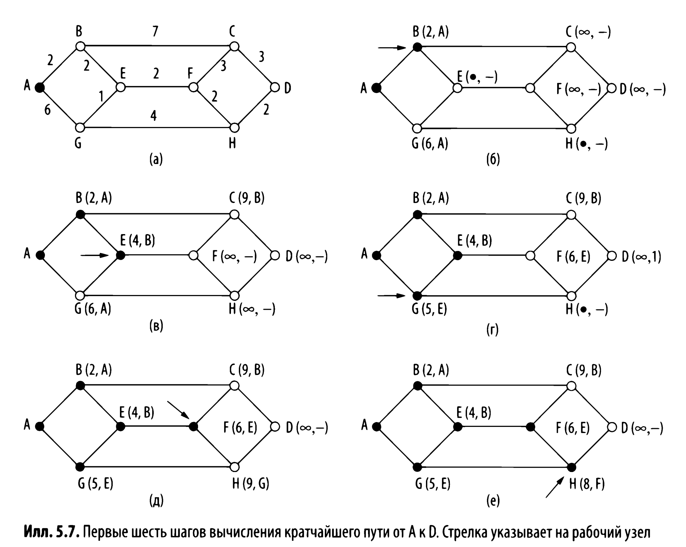

# ЛР3 - RIP/EIGRP/OSPF

> Данная лаба построена вокруг использования протоколов RIP, EIGRP и OSPF. 

## Условие

Дана следующая тополология:

В ней соотв нужно настроить указанные протоколы.

Более наглядно(пока не перерисовал)

## Теория

> Теория по каждому протоколу, который используется в этой лабе. Делал для себя, так что в каких то моментах может быть не супер полно, но основные моменты точно будут

### Оглавление

добавлю позже

### Термины

Тут основные термины, которые могут в этой лабе встречаться(из лекций и не только)
#### Административное расстоние

> Из лекций:
степень доверия источнику информации

Из вики:

Административное расстояние — это степень надёжности источника маршрутной информации. Существует 3 источника маршрутной информации — протоколы динамической маршрутизации, статические маршруты и непосредственно подключенные сети. Используется маршрутизаторами для выбора оптимального маршрута при наличии двух и более различных маршрутов до одной цели по различным протоколам маршрутизации. Каждому протоколу маршрутизации назначается приоритет надёжности (достоверности), от максимального до минимального, указанный с помощью значения административного расстояния.

Там же есть вот такая таблица с значениями для протоклов в Cisco железках

| Источник маршрута | Значения расстояния по умолчанию | Обознач в таблице маршрутизации |
|----------|----------|----------|
| Подлкюченный интерфейс | 0 | С |
| Статический маршрут | 1 | S |
| EIGRP | 5 | D |
| iEIGRP | 90 | D | 
| IGRP | 100 | I |
| OSPF | 110 | O |
| RIP | 120 | R |
| EGP | 140 | E |
 
#### Метрика расстояния в терминологии сетей

> Из лекций: расстояние от данного маршрута до сети назначения

Расстояние мы измеряем в `хопах`

Количество хопов определеяется количество устройств(маршрутизаторов) через которых прошел трафик на пути от источника к получателю

#### Концепция кратчайшего пути

Концепция кратчайшего пути (shortest path) требует некоторого пояснения.Один из способов измерения длины пути состоит в подсчете количества транзитных участков. Можно измерять расстояния в километрах. Но очевидно, что это не самые оптимальные метрики в данном случае.
Однако помимо количества тран:штных участков и физической длины линий
сеть и другие параметры. Например, каждому ребру можно присвоить метку:

- средней задержки стандартного тестового пакета, которая измеряется каждый час. В таком графе кратчайшим является самый быстрый путь, а не путь с наи­меньшим количеством ребер или километров.

- пропуск­ной способности

- средней загруженности

- стоимости связи

- величины задержки

Изменяя весовую функцию, алгоритм может вычислять
«кратчайший» путь с учетом любого критерия или их комбинаций.

#### Алгоритм Дейкстры
Алгоритм Дейкстры — это алгоритм на графах, который находит кратчайший путь от одной вершины до всех остальных в взвешенном графе без отрицательных весов рёбер. В контексте сетевых топологий это означает нахождение наиболее эффективного маршрута для передачи данных от источника к каждому узлу в сети. Вот как работает алгоритм:

1. Инициализация: Алгоритм начинается с инициализации. Отмечаем стартовую вершину как текущую и устанавливаем расстояние до неё равным нулю, а до всех остальных вершин — бесконечностью.

2. Поиск кратчайших расстояний: Для текущей вершины рассматриваются все её соседи. Для каждого соседа вычисляется сумма веса ребра, ведущего к этому соседу, и текущего кратчайшего расстояния до исходной вершины. Если полученное расстояние меньше уже известного кратчайшего расстояния до этого соседа, обновляем значение кратчайшего пути.

3. Обновление маршрутов: После того как все соседи текущей вершины были рассмотрены, вершина помечается как "посещенная". Это означает, что кратчайший путь до неё уже найден.

4. Выбор следующей вершины: Следующей текущей вершиной становится непосещенная вершина с наименьшим известным расстоянием до исходной вершины.

5. Повторение процесса: Процесс повторяется до тех пор, пока не будут посещены все вершины или пока не будет найден кратчайший путь до конечной вершины, если задача стоит найти путь только до одной конкретной вершины.

6. Результат: В конце алгоритма у нас есть карта кратчайших расстояний от исходной вершины до всех остальных в графе.

Алгоритм Дейкстры эффективен для нахождения кратчайшего пути в сетях с динамически меняющимися весами рёбер, например, из-за изменения загруженности сети. Однако он не предназначен для работы с отрицательными весами рёбер, для которых лучше подходит, например, алгоритм Беллмана-Форда.

#### Статическая маршрутизация
> Из лекций: 
Человек прописал самостоятельно

Pros and Cons:
- быстро, не нагружает оборудование излишними вычислениями

- вообще не поддерживает изменений топологии и не адаптируется к отказам элементов сети

#### Динамическая маршрутизация

Динамическая маршрутизация — это процесс, при котором маршрутизаторы автоматически выбирают путь данных по сети. Системы динамической маршрутизации способны адаптироваться к изменениям в сетевой топологии, например, к отказам оборудования или изменению загрузки каналов. Маршрутизаторы обмениваются информацией о топологии сети с помощью протоколов маршрутизации, и на основе этой информации обновляют свои таблицы маршрутизации.

Примеры протоколов динамической маршрутизации:

- RIP (Routing Information Protocol): Один из старейших протоколов динамической маршрутизации, использующий количество промежуточных узлов (хопов) в качестве метрики для определения кратчайшего пути.

- OSPF (Open Shortest Path First): Протокол маршрутизации внутри автономной системы, использующий состояние каналов и методы алгоритма Дейкстры для определения оптимального пути.

- EIGRP (Enhanced Interior Gateway Routing Protocol): Расширенная версия IGRP, разработанная компанией Cisco, использующая свои алгоритмы для быстрого распространения и адаптации к изменениям в сети.

- BGP (Border Gateway Protocol): Протокол междоменной маршрутизации, который используется для обмена информацией о маршрутизации между автономными системами в Интернете.

Эти протоколы обеспечивают гибкость и масштабируемость в сетевых средах, позволяя маршрутизаторам автоматически адаптироваться к изменениям и обеспечивать надежную доставку данных.

#### Дистанционно векторные алгоритмы

Алгоритмы маршрутизации по вектору расстояний ( distance vector routing) работают, опираясь на таблицы (то есть векторы), поддерживаемые всеми маршрутизаторами. Эти таблицы содержат сведения об известных кратчайших путях к каждому из возможных адресатов и о том, какое соединение следует использовать. Для обновления содержимого таблиц производится обмен ин­формацией с соседними маршрутизаторами. В результате любой маршрутизатор знает кратчайший путь до всех получателей.

#### Wild Card Mask

Просто инвертированая маска для

#### ECMP(Equal Cost Multi-Path)

### RIP

Пока не перенес из другого файла