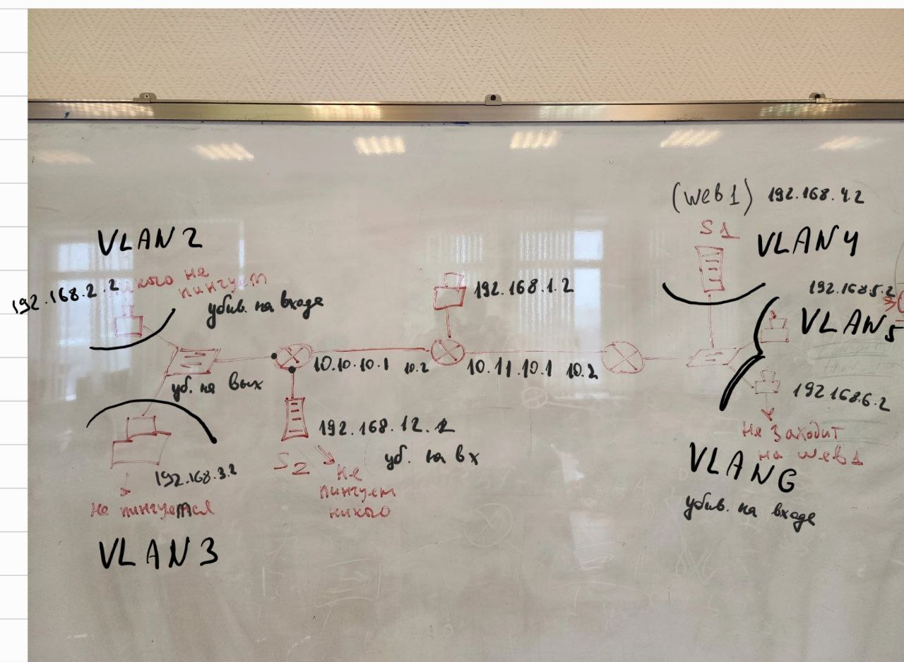

# ЛР4 - Access-List

> Данная лаба построена вокруг использования Access-List

## Оглавление

## Условие

Дана следующая тополология:


В ней соотв нужно настроить\

## Теория

## Настройка 

Первым делом соберём топологию.



Далее, согласно рисунку натсроим IP на конечных устройствах.

### Настройка VLAN

#### Настройка коммутатора

Теперь настроим VLAN на коммутаторах. Пример настройки VLAN на левом коммутаторе, не забываем сообщить о VLAN с правого коммутатора.

```
switch(config)#int fa0/1
switch(config-if)#switchport mode access
switch(config-if)#switchport access vlan 2
switch(config)#int fa0/2
switch(config-if)#switchport mode access
switch(config-if)#switchport access vlan 3
switch(config)#int fa0/3
switch(config-if)#switchport mode trunk
switch(config-if)#ex
switch(config)#vlan 4
switch(config)#vlan 5
switch(config)#vlan 6
```

#### Настройка роутера

Теперь настроим роутеры. 

##### Настройка VLAN левого роутера

```
router1(config)#int fa0/0 
router1(config-if)#no sh

router1(config-if)#int fa0/0.2 
router1(config-subif)#encapsulation dot1q 2
router1(config-subif)#ip address 192.168.2.1 255.255.255.0

router1(config-subif)#int fa0/0.3
router1(config-subif)#encapsulation dot1q 3
router1(config-subif)#ip address 192.168.3.1 255.255.255.0

router1(config-subif)#int fa1/0
router1(config-if)#ip address 192.168.12.1 255.255.255.0
router1(config-if)#no sh

// Настройка связи с другими роутерами. Напишем вначале для правых VLAN

router1(config-if)#int fa0/1
router1(config-if)#ip address 10.10.10.1 255.255.255.252
router1(config-if)#no sh

router1(config-if)#int fa0/1.4
router1(config-subif)#encapsulation dot1q 4
router1(config-subif)#ip address 10.10.14.1 255.255.255.252

router1(config-subif)#int fa0/1.5
router1(config-subif)#encapsulation dot1q 5
router1(config-subif)#ip address 10.10.15.1 255.255.255.252

router1(config-subif)#int fa0/1.6
router1(config-subif)#encapsulation dot1q 6
router1(config-subif)#ip address 10.10.16.1 255.255.255.252

// Настройка связи с другими роутерами. Напишем левые VLAN. Это нужна для приёма своих VLAN.

router1(config-subif)#int fa0/1.2
router1(config-subif)#encapsulation dot1q 2
router1(config-subif)#ip address 10.10.12.1 255.255.255.252

router1(config-subif)#int fa0/1.3
router1(config-subif)#encapsulation dot1q 3
router1(config-subif)#ip address 10.10.13.1 255.255.255.252
```

##### Настройка VLAN роутера посередине

```
router2(config)#int fa1/0
router2(config-if)#ip address 192.168.1.1 255.255.255.0
router2(config-if)#no sh

// Настройка связи с левым роутером

router2(config-if)#int fa0/0
router2(config-if)#ip address 10.10.10.2 255.255.255.252
router2(config-if)#no sh

router2(config-if)#int fa0/0.2
router2(config-subif)#encapsulation dot1q 2
router2(config-subif)#ip address 10.10.12.2 255.255.255.252

router2(config-subif)#int fa0/0.3
router2(config-subif)#encapsulation dot1q 3
router2(config-subif)#ip address 10.10.13.2 255.255.255.252

router2(config-if)#int fa0/0.4
router2(config-subif)#encapsulation dot1q 4
router2(config-subif)#ip address 10.10.14.2 255.255.255.252

router2(config-subif)#int fa0/0.5
router2(config-subif)#encapsulation dot1q 5
router2(config-subif)#ip address 10.10.15.2 255.255.255.252

router2(config-subif)#int fa0/0.6
router2(config-subif)#encapsulation dot1q 6
router2(config-subif)#ip address 10.10.16.2 255.255.255.252

// Настройка связи с правым роутером

router2(config-if)#int fa0/1
router2(config-if)#ip address 10.11.10.1 255.255.255.252
router2(config-if)#no sh

router2(config-if)#int fa0/1.2
router2(config-subif)#encapsulation dot1q 2
router2(config-subif)#ip address 10.11.12.1 255.255.255.252

router2(config-subif)#int fa0/1.3
router2(config-subif)#encapsulation dot1q 3
router2(config-subif)#ip address 10.11.13.1 255.255.255.252

router2(config-if)#int fa0/1.4
router2(config-subif)#encapsulation dot1q 4
router2(config-subif)#ip address 10.11.14.1 255.255.255.252

router2(config-subif)#int fa0/1.5
router2(config-subif)#encapsulation dot1q 5
router2(config-subif)#ip address 10.11.15.1 255.255.255.252

router2(config-subif)#int fa0/1.6
router2(config-subif)#encapsulation dot1q 6
router2(config-subif)#ip address 10.11.16.1 255.255.255.252
```

##### Настройка VLAN правого роутера

```
router3(config)#int fa0/1 
router3(config-if)#no sh

router3(config-if)#int fa0/1.4
router3(config-subif)#encapsulation dot1q 4
router3(config-subif)#ip address 192.168.4.1 255.255.255.0

router3(config-subif)#int fa0/1.5
router3(config-subif)#encapsulation dot1q 5
router3(config-subif)#ip address 192.168.5.1 255.255.255.0

router3(config-subif)#int fa0/1.6
router3(config-subif)#encapsulation dot1q 6
router3(config-subif)#ip address 192.168.6.1 255.255.255.0

// Настройка связи с другими роутерами. Напишем все VLAN слева

router3(config-subif)#int fa0/0
router3(config-if)#no sh
router3(config-if)#ip address 10.11.10.2 255.255.255.252

router3(config-if)#int fa0/0.2
router3(config-subif)#encapsulation dot1q 2
router3(config-subif)#ip address 10.11.12.2 255.255.255.252

router3(config-if)#int fa0/0.3
router3(config-subif)#encapsulation dot1q 3
router3(config-subif)#ip address 10.11.13.2 255.255.255.252

router3(config-if)#int fa0/0.4
router3(config-subif)#encapsulation dot1q 4
router3(config-subif)#ip address 10.11.14.2 255.255.255.252

router3(config-if)#int fa0/0.5
router3(config-subif)#encapsulation dot1q 5
router3(config-subif)#ip address 10.11.15.2 255.255.255.252

router3(config-if)#int fa0/0.6
router3(config-subif)#encapsulation dot1q 6
router3(config-subif)#ip address 10.11.16.2 255.255.255.252
```

### Настройка OSPF

#### Настройка среднего роутера

Начнём настройку с роутера посередине

```
router2(config)#interface loopback 0
router2(config-if)#ip address 192.168.100.1 255.255.255.255
router2(config-if)#no sh

router2(config-if)#router ospf 1
router2(config-if)#network 10.10.10.0 0.0.0.3 area 0
router2(config-if)#network 10.10.12.0 0.0.0.3 area 0
router2(config-if)#network 10.10.13.0 0.0.0.3 area 0
router2(config-if)#network 10.10.14.0 0.0.0.3 area 0
router2(config-if)#network 10.10.15.0 0.0.0.3 area 0
router2(config-if)#network 10.10.16.0 0.0.0.3 area 0
router2(config-if)#network 10.11.10.0 0.0.0.3 area 0
router2(config-if)#network 10.11.12.0 0.0.0.3 area 0
router2(config-if)#network 10.11.13.0 0.0.0.3 area 0
router2(config-if)#network 10.11.14.0 0.0.0.3 area 0
router2(config-if)#network 10.11.15.0 0.0.0.3 area 0
router2(config-if)#network 10.11.16.0 0.0.0.3 area 0
router2(config-if)#network 192.168.1.0 0.0.0.255 area 0
```

#### Настройка левого роутера

```
router1(config)#interface loopback 0
router1(config-if)#ip address 192.168.100.2 255.255.255.255
router1(config-if)#no sh

router1(config-if)#router ospf 1
router1(config-if)#network 10.10.10.0 0.0.0.3 area 0
router1(config-if)#network 10.10.12.0 0.0.0.3 area 0
router1(config-if)#network 10.10.13.0 0.0.0.3 area 0
router1(config-if)#network 10.10.14.0 0.0.0.3 area 0
router1(config-if)#network 10.10.15.0 0.0.0.3 area 0
router1(config-if)#network 10.10.16.0 0.0.0.3 area 0

router1(config-if)#network 192.168.2.0 0.0.0.255 area 0
router1(config-if)#network 192.168.3.0 0.0.0.255 area 0
router1(config-if)#network 192.168.12.0 0.0.0.255 area 0
```

#### Настройка правого роутера

```
router3(config)#interface loopback 0
router3(config-if)#ip address 192.168.100.3 255.255.255.255
router3(config-if)#no sh

router3(config-if)#router ospf 1
router3(config-if)#network 10.11.10.0 0.0.0.3 area 0
router3(config-if)#network 10.11.12.0 0.0.0.3 area 0
router3(config-if)#network 10.11.13.0 0.0.0.3 area 0
router3(config-if)#network 10.11.14.0 0.0.0.3 area 0
router3(config-if)#network 10.11.15.0 0.0.0.3 area 0
router3(config-if)#network 10.11.16.0 0.0.0.3 area 0

router3(config-if)#network 192.168.4.0 0.0.0.255 area 0
router3(config-if)#network 192.168.5.0 0.0.0.255 area 0
router3(config-if)#network 192.168.6.0 0.0.0.255 area 0
```

### Теория NAT

Настройка NAT 

```
router(config)#int fa0/0
router(config-if)#ip nat outside // Внешний NAT
router(config-if)#int fa0/0.1
router(config-subif)#ip nat inside // Внутренниий NAT
```

### Настройка Access-List

#### Теория по AL

- Убивается на выходе - обычно используется стандартный AL (привязвается к выходному интерфейсу)
- Убивается на входе - обычно используется расширенный AL (привязвается к входному интерфейсу)

Настройка стандартного AL на выходящий трафик

```
// NAME - название AL, standard - AL работает на основе IP-сети источника
router1(config)#ip access-list standard NAME

// Теперь разрешим выйти из роутера сеть источника 192.168.1.0
router1(config-if)# permit 192.168.1.0 0.0.0.255
```

Настройка расширенного AL на входящий трафик

```
// NAME - название AL, extended - AL работает на основе 
router1(config)#ip access-list extended NAME
// deny - запретить ip - все протоколы any - любой источник DESTINATION-IP - IP-сети получателя
router1(config-ext-nacl)#deny ip any DESTINATION-IP WILDCARD-MASK
router1(config-ext-nacl)#deny ip 192.168.2.0 0.0.0.255 any

```

Привязка AL к интерфейсу

```
// in - на входящий трафик out - выходящий трафик
router1(config)#int fa0/0
router1(config-if)#ip access-group NAME in/out
```

#### Настройка роутеров

##### Настройка левого роутера

Запретим ПК из VLAN2 пинговать всех. Для этого надо использовать расширенный AL, который удаляет входящие запросы. А именно запрещаем ICMP запросы с этого ПК, но разрешаем всё остальное. И не забываем привязать AL к нужному интерфейсу на ВХОД (in).
```
router1(config)#ip access-list extended VLAN2-OUT
router1(config-ext-nacl)#deny icmp host 192.168.2.2 any echo
router1(config-ext-nacl)#permit ip any any
router1(config-ext-nacl)#ex
router1(config)#int fa0/0.2
router1(config-if)#ip access-group VLAN2-OUT in
```

Запретим второму сервеу S2 пинговать всех. А именно запрещаем ICMP запросы с этого сервера, но разрешаем всё остальное.
```
router1(config)#ip access-list extended S2-OUT
router1(config-ext-nacl)#deny icmp host 192.168.12.2 any echo
router1(config-ext-nacl)#permit ip any any
router1(config-ext-nacl)#ex
router1(config)#int fa1/0
router1(config-if)#ip access-group S2-OUT in
```

И, наконец, запретим пинговать ПК из VLAN3.
```
router1(config)#ip access-list extended VLAN3-IN
router1(config-ext-nacl)#deny icmp any host 192.168.3.2 echo
router1(config-ext-nacl)#permit ip any any
router1(config-ext-nacl)#ex
router1(config)#int fa0/0.3
router1(config-if)#ip access-group VLAN3-IN out
```

##### Настройка правого роутера
Запретим ПК из VLAN6 заходить на web.
```
router3(config)#ip access-list extended VLAN6-OUT
router3(config-ext-nacl)#deny tcp host 192.168.6.2 host 192.168.4.2 eq www
router3(config-ext-nacl)#permit ip any any
router3(config-ext-nacl)#ex
router3(config)#int fa0/1.6
router3(config-if)#ip access-group VLAN6-OUT in
```

## Победа

Готовая топология!!!!

