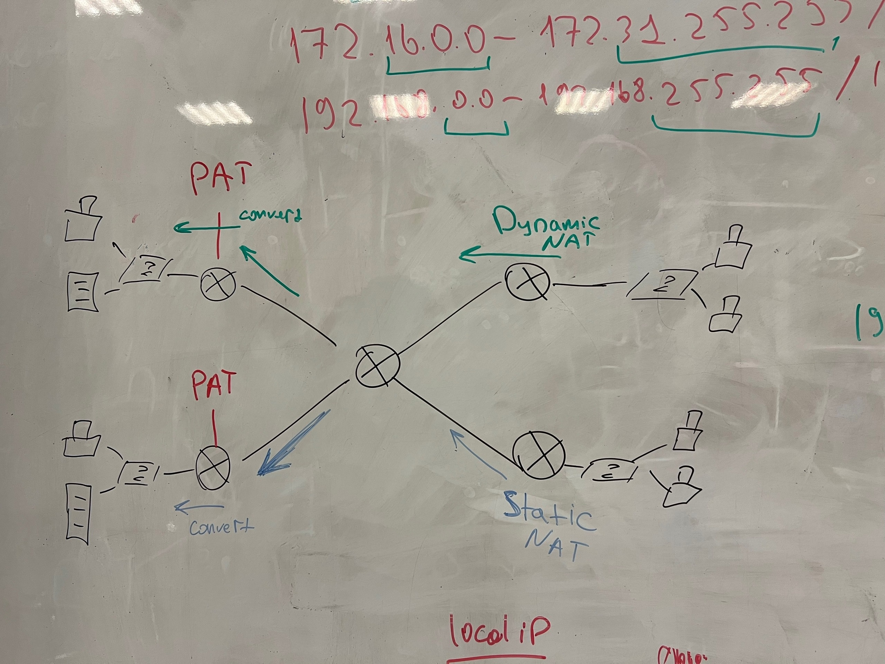

# ЛР5 - NAT

> Данная лаба построена вокруг NAT

## Оглавление

- [Условие лабы](#условие)
- [Настройка](#настройка)
- [Настройка VLAN](#настройка-vlan)
- [Настройка коммутатора](#настройка-коммутатора)
- [Настройка роутера](#настройка-роутера)
- [Настройка VLAN левого роутера](#настройка-vlan-левого-роутера)
- [Настройка VLAN роутера посередине](#настройка-vlan-роутера-посередине)
- [Настройка VLAN правого роутера](#настройка-vlan-правого-роутера)
- [Настройка OSPF](#настройка-ospf)
- [Настройка OSPF среднего роутера](#настройка-ospf-среднего-роутера)
- [Настройка OSPF левого роутера](#настройка-ospf-левого-роутера)
- [Настройка OSPF правого роутера](#настройка-ospf-правого-роутера)
- [Теория NAT](#теория-nat)
- [Настройка Access-List](#настройка-access-list)
- [Теория по AL](#теория-по-al)
- [Настройка роутеров](#настройка-роутеров)
- [Настройка AL левого роутера](#настройка-al-левого-роутера)
- [Настройка AL правого роутера](#настройка-al-правого-роутера)
- [Победа](#победа)
- [Настройка DHCP](#настройка-dhcp)


## Условие

Дана следующая тополология:

Зеленые стрелки это преобразование натов типо для верхней правой локалки
А синия стрелка для нижней правой локалки



В ней соотв нужно настроить

## Настройка 

Первым делом соберём топологию.


Далее, согласно рисунку натсроим IP на конечных устройствах.

### Настройка PAT

Для настройки NAT определяем внутренние (смотрят на локальную подсеть) и внешние (смотрят в другие сети)
интерфейсы роутера роутера
для соответствующих интерфейсов прописываем команды: ip NAT outside и ip NAT inside
Например:

```
router(config)#int fa0/1
router(config-if)#ip NAT inside

router(config)#int fa0/1
router(config-if)#ip NAT outside


Router(config)#
Router(config)#ip a
Router(config)#ip access-list s
Router(config)#ip access-list standard PAT-10
Router(config-std-nacl)#perm
Router(config-std-nacl)#permit 10.0.0.0 ?
  A.B.C.D  Wildcard bits
  <cr>
Router(config-std-nacl)#permit 10.0.0.0 0.255.255.255?
A.B.C.D  
Router(config-std-nacl)#permit 10.0.0.0 0.255.255.255
Router(config-std-nacl)#

Router(config)#ip nat inside source list PAT-10 interface fastEthernet 0/0 overload 
```

Команда `ip nat inside source list` используется в Cisco IOS для настройки NAT (Network Address Translation). Давайте разберем, что означают компоненты этой команды:

1. `ip nat inside source`: Эта часть команды указывает, что вы настраиваете перевод адресов (NAT) для пакетов, идущих изнутри сети.

2. `list PAT-10`: Это ссылка на расширенный список доступа (ACL), в котором определены те адреса или диапазоны адресов, которые будут подвергнуты переводу. В данном случае, скорее всего, PAT-10 - это имя для такого списка доступа.

3. `interface fastEthernet 0/0`: Эта часть команды указывает интерфейс, через который будет выполняться NAT. В данном случае, перевод будет выполняться через интерфейс FastEthernet 0/0.

4. `overload`: Этот параметр указывает, что вы используете PAT (Port Address Translation), также известный как портовый перевод. Это означает, что несколько устройств в вашей локальной сети будут использовать один и тот же глобальный IP-адрес, но с разными портами для идентификации каждого устройства.

Таким образом, эта команда означает, что для пакетов, соответствующих условиям в ACL PAT-10, будет выполняться перевод адресов (NAT) через интерфейс FastEthernet 0/0 с использованием PAT для обеспечения уникальности портов для каждого устройства в локальной сети.


### Настройка VLAN

#### Настройка коммутатора

Теперь настроим VLAN на коммутаторах. Пример настройки VLAN на левом коммутаторе, не забываем сообщить о VLAN с правого коммутатора.

```
switch(config)#int fa0/1
switch(config-if)#switchport mode access
switch(config-if)#switchport access vlan 2
switch(config)#int fa0/2
switch(config-if)#switchport mode access
switch(config-if)#switchport access vlan 3
switch(config)#int fa0/3
switch(config-if)#switchport mode trunk
switch(config-if)#ex
switch(config)#vlan 4
switch(config)#vlan 5
switch(config)#vlan 6
```

#### Настройка роутера

Теперь настроим роутеры. 

##### Настройка VLAN левого роутера

```
router1(config)#int fa0/0 
router1(config-if)#no sh

router1(config-if)#int fa0/0.2 
router1(config-subif)#encapsulation dot1q 2
router1(config-subif)#ip address 192.168.2.1 255.255.255.0

router1(config-subif)#int fa0/0.3
router1(config-subif)#encapsulation dot1q 3
router1(config-subif)#ip address 192.168.3.1 255.255.255.0

router1(config-subif)#int fa1/0
router1(config-if)#ip address 192.168.12.1 255.255.255.0
router1(config-if)#no sh

// Настройка связи с другими роутерами. Напишем вначале для правых VLAN

router1(config-if)#int fa0/1
router1(config-if)#ip address 10.10.10.1 255.255.255.252
router1(config-if)#no sh

router1(config-if)#int fa0/1.4
router1(config-subif)#encapsulation dot1q 4
router1(config-subif)#ip address 10.10.14.1 255.255.255.252

router1(config-subif)#int fa0/1.5
router1(config-subif)#encapsulation dot1q 5
router1(config-subif)#ip address 10.10.15.1 255.255.255.252

router1(config-subif)#int fa0/1.6
router1(config-subif)#encapsulation dot1q 6
router1(config-subif)#ip address 10.10.16.1 255.255.255.252

// Настройка связи с другими роутерами. Напишем левые VLAN. Это нужна для приёма своих VLAN.

router1(config-subif)#int fa0/1.2
router1(config-subif)#encapsulation dot1q 2
router1(config-subif)#ip address 10.10.12.1 255.255.255.252

router1(config-subif)#int fa0/1.3
router1(config-subif)#encapsulation dot1q 3
router1(config-subif)#ip address 10.10.13.1 255.255.255.252
```

##### Настройка VLAN роутера посередине

```
router2(config)#int fa1/0
router2(config-if)#ip address 192.168.1.1 255.255.255.0
router2(config-if)#no sh

// Настройка связи с левым роутером

router2(config-if)#int fa0/0
router2(config-if)#ip address 10.10.10.2 255.255.255.252
router2(config-if)#no sh

router2(config-if)#int fa0/0.2
router2(config-subif)#encapsulation dot1q 2
router2(config-subif)#ip address 10.10.12.2 255.255.255.252

router2(config-subif)#int fa0/0.3
router2(config-subif)#encapsulation dot1q 3
router2(config-subif)#ip address 10.10.13.2 255.255.255.252

router2(config-if)#int fa0/0.4
router2(config-subif)#encapsulation dot1q 4
router2(config-subif)#ip address 10.10.14.2 255.255.255.252

router2(config-subif)#int fa0/0.5
router2(config-subif)#encapsulation dot1q 5
router2(config-subif)#ip address 10.10.15.2 255.255.255.252

router2(config-subif)#int fa0/0.6
router2(config-subif)#encapsulation dot1q 6
router2(config-subif)#ip address 10.10.16.2 255.255.255.252

// Настройка связи с правым роутером

router2(config-if)#int fa0/1
router2(config-if)#ip address 10.11.10.1 255.255.255.252
router2(config-if)#no sh

router2(config-if)#int fa0/1.2
router2(config-subif)#encapsulation dot1q 2
router2(config-subif)#ip address 10.11.12.1 255.255.255.252

router2(config-subif)#int fa0/1.3
router2(config-subif)#encapsulation dot1q 3
router2(config-subif)#ip address 10.11.13.1 255.255.255.252

router2(config-if)#int fa0/1.4
router2(config-subif)#encapsulation dot1q 4
router2(config-subif)#ip address 10.11.14.1 255.255.255.252

router2(config-subif)#int fa0/1.5
router2(config-subif)#encapsulation dot1q 5
router2(config-subif)#ip address 10.11.15.1 255.255.255.252

router2(config-subif)#int fa0/1.6
router2(config-subif)#encapsulation dot1q 6
router2(config-subif)#ip address 10.11.16.1 255.255.255.252
```

##### Настройка VLAN правого роутера

```
router3(config)#int fa0/1 
router3(config-if)#no sh

router3(config-if)#int fa0/1.4
router3(config-subif)#encapsulation dot1q 4
router3(config-subif)#ip address 192.168.4.1 255.255.255.0

router3(config-subif)#int fa0/1.5
router3(config-subif)#encapsulation dot1q 5
router3(config-subif)#ip address 192.168.5.1 255.255.255.0

router3(config-subif)#int fa0/1.6
router3(config-subif)#encapsulation dot1q 6
router3(config-subif)#ip address 192.168.6.1 255.255.255.0

// Настройка связи с другими роутерами. Напишем все VLAN слева

router3(config-subif)#int fa0/0
router3(config-if)#no sh
router3(config-if)#ip address 10.11.10.2 255.255.255.252

router3(config-if)#int fa0/0.2
router3(config-subif)#encapsulation dot1q 2
router3(config-subif)#ip address 10.11.12.2 255.255.255.252

router3(config-if)#int fa0/0.3
router3(config-subif)#encapsulation dot1q 3
router3(config-subif)#ip address 10.11.13.2 255.255.255.252

router3(config-if)#int fa0/0.4
router3(config-subif)#encapsulation dot1q 4
router3(config-subif)#ip address 10.11.14.2 255.255.255.252

router3(config-if)#int fa0/0.5
router3(config-subif)#encapsulation dot1q 5
router3(config-subif)#ip address 10.11.15.2 255.255.255.252

router3(config-if)#int fa0/0.6
router3(config-subif)#encapsulation dot1q 6
router3(config-subif)#ip address 10.11.16.2 255.255.255.252
```

### Настройка OSPF

#### Настройка OSPF среднего роутера

Начнём настройку с роутера посередине

```
router2(config)#interface loopback 0
router2(config-if)#ip address 192.168.100.1 255.255.255.255
router2(config-if)#no sh

router2(config-if)#router ospf 1
router2(config-if)#network 10.10.10.0 0.0.0.3 area 0
router2(config-if)#network 10.10.12.0 0.0.0.3 area 0
router2(config-if)#network 10.10.13.0 0.0.0.3 area 0
router2(config-if)#network 10.10.14.0 0.0.0.3 area 0
router2(config-if)#network 10.10.15.0 0.0.0.3 area 0
router2(config-if)#network 10.10.16.0 0.0.0.3 area 0
router2(config-if)#network 10.11.10.0 0.0.0.3 area 0
router2(config-if)#network 10.11.12.0 0.0.0.3 area 0
router2(config-if)#network 10.11.13.0 0.0.0.3 area 0
router2(config-if)#network 10.11.14.0 0.0.0.3 area 0
router2(config-if)#network 10.11.15.0 0.0.0.3 area 0
router2(config-if)#network 10.11.16.0 0.0.0.3 area 0
router2(config-if)#network 192.168.1.0 0.0.0.255 area 0
```

#### Настройка OSPF левого роутера

```
router1(config)#interface loopback 0
router1(config-if)#ip address 192.168.100.2 255.255.255.255
router1(config-if)#no sh

router1(config-if)#router ospf 1
router1(config-if)#network 10.10.10.0 0.0.0.3 area 0
router1(config-if)#network 10.10.12.0 0.0.0.3 area 0
router1(config-if)#network 10.10.13.0 0.0.0.3 area 0
router1(config-if)#network 10.10.14.0 0.0.0.3 area 0
router1(config-if)#network 10.10.15.0 0.0.0.3 area 0
router1(config-if)#network 10.10.16.0 0.0.0.3 area 0

router1(config-if)#network 192.168.2.0 0.0.0.255 area 0
router1(config-if)#network 192.168.3.0 0.0.0.255 area 0
router1(config-if)#network 192.168.12.0 0.0.0.255 area 0
```

#### Настройка OSPF правого роутера

```
router3(config)#interface loopback 0
router3(config-if)#ip address 192.168.100.3 255.255.255.255
router3(config-if)#no sh

router3(config-if)#router ospf 1
router3(config-if)#network 10.11.10.0 0.0.0.3 area 0
router3(config-if)#network 10.11.12.0 0.0.0.3 area 0
router3(config-if)#network 10.11.13.0 0.0.0.3 area 0
router3(config-if)#network 10.11.14.0 0.0.0.3 area 0
router3(config-if)#network 10.11.15.0 0.0.0.3 area 0
router3(config-if)#network 10.11.16.0 0.0.0.3 area 0

router3(config-if)#network 192.168.4.0 0.0.0.255 area 0
router3(config-if)#network 192.168.5.0 0.0.0.255 area 0
router3(config-if)#network 192.168.6.0 0.0.0.255 area 0
```

### Теория NAT

Настройка NAT 

```
router(config)#int fa0/0
router(config-if)#ip nat outside // Внешний NAT
router(config-if)#int fa0/0.1
router(config-subif)#ip nat inside // Внутренниий NAT
```

### Настройка Access-List

#### Теория по AL

- Убивается на выходе - обычно используется стандартный AL (привязвается к выходному интерфейсу)
- Убивается на входе - обычно используется расширенный AL (привязвается к входному интерфейсу)

Настройка стандартного AL на выходящий трафик

```
// NAME - название AL, standard - AL работает на основе IP-сети источника
router1(config)#ip access-list standard NAME

// Теперь разрешим выйти из роутера сеть источника 192.168.1.0
router1(config-if)# permit 192.168.1.0 0.0.0.255
```

Настройка расширенного AL на входящий трафик

```
// NAME - название AL, extended - AL работает на основе 
router1(config)#ip access-list extended NAME
// deny - запретить ip - все протоколы any - любой источник DESTINATION-IP - IP-сети получателя
router1(config-ext-nacl)#deny ip any DESTINATION-IP WILDCARD-MASK
router1(config-ext-nacl)#deny ip 192.168.2.0 0.0.0.255 any

```

Привязка AL к интерфейсу

```
// in - на входящий трафик out - выходящий трафик
router1(config)#int fa0/0
router1(config-if)#ip access-group NAME in/out
```

#### Настройка роутеров

##### Настройка AL левого роутера

Запретим ПК из VLAN2 пинговать всех. Для этого надо использовать расширенный AL, который удаляет входящие запросы. А именно запрещаем ICMP запросы с этого ПК, но разрешаем всё остальное. И не забываем привязать AL к нужному интерфейсу на ВХОД (in).
```
router0(config)#ip access-list extended VLAN2-OUT
router0(config-ext-nacl)#deny icmp host 192.168.2.2 any echo
router0(config-ext-nacl)#permit ip any any
router0(config-ext-nacl)#ex
router0(config)#int fa0/0.2
router0(config-if)#ip access-group VLAN2-OUT in
```

Запретим второму сервеу S2 пинговать всех. А именно запрещаем ICMP запросы с этого сервера, но разрешаем всё остальное.
```
router0(config)#ip access-list extended S2-OUT
router0(config-ext-nacl)#deny icmp host 192.168.12.2 any echo
router0(config-ext-nacl)#permit ip any any
router0(config-ext-nacl)#ex
router0(config)#int fa1/0
router0(config-if)#ip access-group S2-OUT in
```

И, наконец, запретим пинговать ПК из VLAN3.
```
router0(config)#ip access-list extended VLAN3-IN
router0(config-ext-nacl)#deny icmp any host 192.168.3.2 echo
router0(config-ext-nacl)#permit ip any any
router0(config-ext-nacl)#ex
router0(config)#int fa0/0.3
router0(config-if)#ip access-group VLAN3-IN out
```

##### Настройка AL правого роутера
Запретим ПК из VLAN6 заходить на web.
```
router3(config)#ip access-list extended VLAN6-OUT
router3(config-ext-nacl)#deny tcp host 192.168.6.2 host 192.168.4.2 eq www
router3(config-ext-nacl)#permit ip any any
router3(config-ext-nacl)#ex
router3(config)#int fa0/1.6
router3(config-if)#ip access-group VLAN6-OUT in
```

## Победа

Готовая топология!!!!


## Настройка DHCP

Топология, которую нужно реализовать показана на рисунке ниже. 

### Задания, которые нужно сделать:

1. Настроить работу DHCP сервера в подсети VLAN1.
2. В подсети, в которой настроен DHCP сервер, сдлеать, чтобы нечётные хосты не могли получать почту (протокол POP3 либо IMAP4).
2. В подсети, в которой настроен DHCP сервер, сдлеать, чтобы чётные хосты не могли отправлять почту (протокол SMTP).
3. VLAN2 получает IP с DHCP сервера S2. (ВНИМАНИЕ между VLAN2 и S2 находится маршрутизатор, в отличие от 1 задания).
4. Настроить удаление DISCOVER пакетов у S2 сервера.


### Задание 1

Первым делом у PC надо удалить все статические IP, а DHCP серверу задать статический IP (192.168.1.2), включая маску и шлюз по-умолчанию (192.168.1.1).


Далее переходим во вкладку "Services", выбираем настройку "DHCP". В нём уже создан дефолтный "serverPool". Можно изменить его, так как у нас всего один VLAN. для этого Меняем "Default Gateway" на тот, который используется в данном VLAN, поскольку используется VLAN1, то задаём (192.168.1.1). В поле "DNS Server" указываем DNS гугла (8.8.8.8). В поле "Start IP Address" указываем IP сети (192.168.1.0) и задаём его маску (255.255.255.0). Также, не забыаем над именем включить флажок "On" для включения сервера.


Теперь настроим роутер. Он должен пересылать DHCP запросы DHCP серверу. Для этого нужно настроить интерфейс (или сабинтерфейсы, если больше одного VLANа в подсети). В нашем случае за подсеть отвечает интерфейс fa1/0, поэтому напишем данные команды:

```
router1(config)#int fa1/0
router1(config-if)#ip helper-address 192.168.1.2
```

И, наконец, на ПК заходим в настройку IP и выключаем DHCP. После чего автоматически появится IP.


### Задание 3

Первым делом у PC из VLAN2 надо удалить cтатический IP, а DHCP серверу задать статический IP (192.168.12.2), включая маску и шлюз по-умолчанию (192.168.12.1).

Далее переходим во вкладку "Services", выбираем настройку "DHCP". В нём уже создан дефолтный "serverPool" с IP нашего сервера, поскольку мы настраиваем работа только для VLAN2, то дефолтный "serverPool" менять не будем, хотя он не рабочий, так как неверно указан шлюз по-умолчанию. 

Создадим новый "Pool". Для этого менеям "Pool Name", например, на имя "DHCP-VLAN2". Включаем флажок "On" для включения сервера. Меняем "Default Gateway" на шлюз-поумолчанию в подсети VLAN2 (192.168.2.1). В поле "DNS Server" указываем DNS гугла (8.8.8.8). В поле "Start IP Address" указываем IP сети (192.168.2.0) и задёи его маску (255.255.255.0). Нажимаем кнопку "Add".


Теперь настроим роутер. Он должен пересылать DHCP запросы DHCP серверу. Для этого нужно настроить интерфейс (или сабинтерфейсы, если больше одного VLANа в подсети). В нашем случае за подсеть отвечает интерфейс fa0/0.2, поэтому напишем данные команды:

```
router1(config)#int fa0/0.2
router1(config-subif)#ip helper-address 192.168.12.2
```

Несколько вланов

мы его оставляем и создаём новый. Для этого менеям "Pool Name", например, на имя "DHCP-VLAN1". Меняем "Default Gateway" на тот, который задавали статически (192.168.1.1), то есть до роутера. В поле "DNS Server" указываем DNS гугла (8.8.8.8). В поле "Start IP Address" указываем IP сети (192.168.1.0) и задёи его маску (255.255.255.0). Также, не забыаем над именем включить флажок "On" для включения сервера.

Нажимаем кнопку "Add". Если бы в данной подсети было несколько вланов, то надо было создать "Pool" для каждого влана, указывая свои шлюзы по-умолчанию, и другие "Start IP Address". Но в данной сети у нас только VLAN1, поэтому одного "Pool" достаточно.

