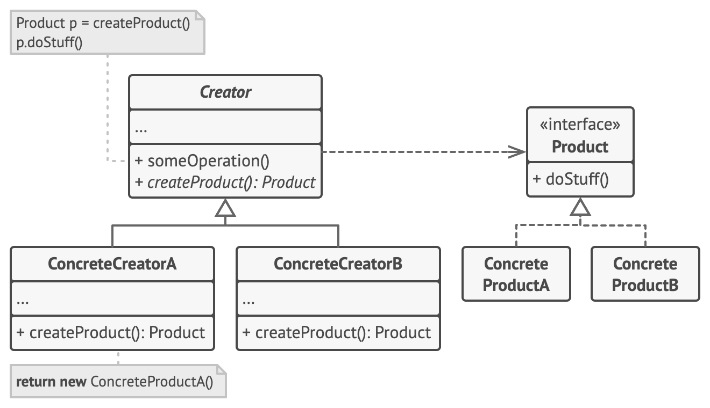
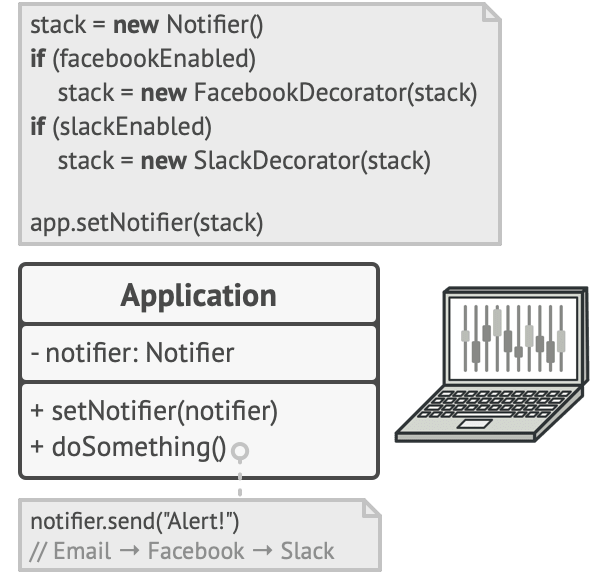
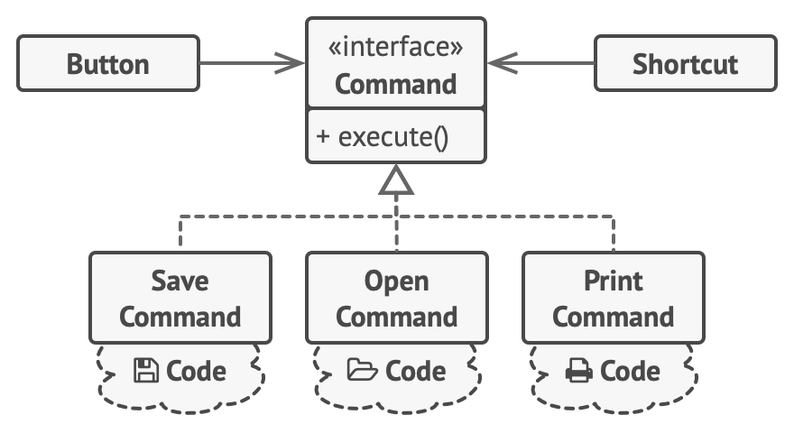

# Современные средства разработки ПО - Теория

В данном разделе будет описана теория по ССРПО. Аналогично с ОС - буду идти по презентациям, которые предоставил Фетисов. Просто в некоторых моментах буду дополнять каким-то картинками и примерами, например в шаблонах это точно нужно, ибо так запомнить проще. Постараюсь выписывать только то, что понадобится для РК.

## Table of content

- [Современные средства разработки ПО - Теория](#современные-средства-разработки-по---теория)
- [Лекция 1 - Введение](#лекция-1---введение)
- [Основные признаки сложного ПО](#основные-признаки-сложного-по)
- [Дополнительные признаки](#дополнительные-признаки)
- [Проблемы при разработке сложного ПО](#проблемы-при-разработке-сложного-по)
- [Как можно решить данные проблемы](#как-можно-решить-данные-проблемы)
- [Проблемы указателей в C++](#проблемы-указателей-в-c++)
- [Идиома RAII](#идиома-raii)
- [ООП](#ооп)
- [Основные принципы ООП](#основные-принципы-ооп)
- [Состояние объекта](#состояние-объекта)
- [Инвариант класса](#инвариант-класса)
- [Нарушение инварианта класса](#нарушение-инварианта-класса)
- [Вариативность состояний класса](#вариативность-состояний-класса)
- [Типы вариантивности состояний класса](#типы-вариантивности-состояний-класса)
- [Лекция 2/3 - Шаблоны проектирования](#лекция-2---шаблоны-проектирования)
- [ШП - определение](#шп---определение)
- [Виды ШП](#виды-шп)
- [Роль шаблонов проектирования](#роль-шаблонов-проектирования)
- [Список ШП](#список-шп)
- [Лекция 4 - Принципы SOLID](#лекция-4---принципы-solid-антипаттерны)
- [Single Reponsibility Principle](#принцип-единственной-ответственности---single-responsibility-principle)
- [Open Closed Principle](#принцип-открытостизакрытости---open-closed-principle)
- [Liskov Substitution Principle](#принцип-подстановки-барбары-лисков---liskov-substitution-principle)
- [Interface Segregation Principle](#принцип-разделения-интерфейса---interface-segregation-principle)
- [Dependency Inversion Principle](#принцип-инверсии-зависимостей---dependency-inversion-principle)
- [Антипаттерны](#антипаттерны)

## Лекция 1 - Введение

> В этой лекции будут совсем основные определения и понятия. В общей сложности - штук 5-6 вопросов их нее может быть на РК.

### Основные признаки сложного ПО

- **Комплексность** - то есть, собственно сложность, которая проявляется в большом количестве объектов, их вложенности друг в друга и связями между ними.

- **Длительный жизненный цикл** - то есть, необходимость не только разработать ПО, но и поддерживать его развитие на протяжении длительного времени.

- **Работа в команде** - невозможность работать и поддерживать сложное ПО в одиночку за приемлимое время, а также устойчивость проекта в условиях текучки каманды разработки.

### Дополнительные признаки

- **Многопоточность** - усугубляет сложность за счет необходимости согласования параллельных потоков.

- **Многопроцессность** - необходимо введение протоколов взаимодействия процессов.

- **Распределенность** - усугубляет сложность за счет необходимости введения протоколов взаимодействия узлов.

### Проблемы при разработке сложного ПО

- Нечеткие или меняющиеся требования

- Большое количество взаимодействующих плохо разделяемых и/или нечетких понятий предметной области

- Необходимость периодического внесения изменений в исходный код ПО

- Большое количество разрабов

### Как можно решить данные проблемы

- Адаптивная архитектура или адаптивный код

- Введение методологий(Enterprise, MSF, RUP, Agile, Scrum. etc)

- CI/CD

- Автотесты, автодокументация

- Прочая хрень

### Проблемы указателей в C++

Может быть nullptr

- В результате UB, потом может и упасть

Можно забыть инициировать 

- Неопределённое поведение, крах программы

Может указывать на уже несуществующий объект
 
- Неопределённое поведение, крах программы

Можно забыть выделить память

- Неопределённое поведение, крах программы

Можно забыть освободить память

- Утечка памяти


### Идиома RAII


> ***RAII — Resource Acquisition Is Initialization (бук. 
«получение ресурса есть инициализация»)***

Ресурс предоставляется "напрокат" третьей стороной, например ОС и его обязательно нужно вернуть. Примеры ресурсов(мьютексы, память, файл)

Даннная идиома предлагает связывать с каждым таким ресурсом определенный автоматический объект.

***Пример из жизни:***

Блок кода - комната в помещении

Выход из блока - выход из комнаты

Исключение - эвакуация из пожарного выхода

Ресурс - электричество

Освобождение ресурса - уходя, гасите свет.

Из вики:

Типичным (хотя и не единственным) способом реализации является организация получения доступа к ресурсу в конструкторе, а освобождения — в деструкторе соответствующего класса. Во многих языках программирования, например в C++, деструктор переменной немедленно вызывается при выходе из её области видимости, когда ресурс необходимо освободить. Это позволяет гарантировать освобождение ресурса при возникновении исключения: код становится безопасным при исключениях.

Пример кода:

```cpp
#include <cstdio>
#include <stdexcept>
  
class file {
public:
    file( const char* filename ) : m_file_handle(std::fopen(filename, "w+")) 
    {
        if( !m_file_handle )
            throw std::runtime_error("file open failure") ;
    }
    ~file() 
    {
        if( std::fclose(m_file_handle) != 0 )
        {
            // fclose() может вернуть ошибку при записи на диск последних изменений
        }
    }

    void write( const char* str ) 
    {
        if( std::fputs(str, m_file_handle) == EOF )
            throw std::runtime_error("file write failure") ;
    }

private:
    std::FILE* m_file_handle ;

    // Копирование и присваивание не реализовано.  Предотвратим их использование,
    // объявив соответствующие методы закрытыми.
    file( const file & ) ;
    file & operator=( const file & ) ;
};

// пример использования этого класса
void example_usage() {
   // открываем файл (захватываем ресурс)
    file logfile("logfile.txt") ;
  
    logfile.write("hello logfile!") ;

    // продолжаем использовать logfile...
    // Можно возбуждать исключения или выходить из функции не беспокоясь о закрытии файла; 
    // он будет закрыт автоматически когда переменная logfile выйдет из области видимости.
}
```
Суть идиомы RAII в том, что класс инкапсулирует владение (захват и освобождение) некоторого ресурса — например, открытого файлового дескриптора. Когда объекты-экземпляры такого класса являются автоматическими переменными, гарантируется, что когда они выйдут из области видимости, будет вызван их деструктор — а значит, ресурс будет освобождён. В данном примере файл будет закрыт корректно, даже если вызов `std::fopen()` вернёт ошибку и будет возбуждено исключение. Более того, если конструктор класса file завершился корректно, это гарантирует то, что файл действительно открыт. В случае ошибки при открытии файла конструктор возбуждает исключение.

При помощи RAII и автоматических переменных можно просто управлять владением нескольких ресурсов. Порядок вызова деструкторов является обратным порядку вызова конструкторов; деструктор вызывается только если объект был полностью создан (то есть, если конструктор не возбудил исключения).

> Чем RAII отличается от сборки мусора?

- Вы не знаете, когда прозойдет возвращение ресурсов и в каком объеме, и не можете гарантировать, будут ли ресурсы доступны в любом заданном состоянии вашей программы. Это заставляет вас писать код так, чтобы это учитывать.

- Если случаются исключения и что-то идет не так, вы можете не получить освобожденные ресурсы, и может возникнуть нехватка ресурсов, что замедлит работу программы, пока сборщик мусора пытается их освободить.

### ООП

> ***ООП - парадигма программирования, основанная на представлении программы в виде совокупности объектов, каждый из которых является 
экземпляром определенного класса, а классы образуют иерархии абстрагирования.***

- **Парадигма** программирования - набор правил, концепций и абстракций определяющих стиль программирования(подход к программированию).

- **Объект** - сущность, обладающая состоянием, свойствами, поведением, свойствами и операциями над ними.

- **Класс** - шаблон, по которому создается объект, т.е элемент, описывающий тип данных и его реализацию.

- **Иерархия абстрагирования** - это способ организации и упорядочивания объектов и классов в системе по уровням абстракции. Эта иерархия помогает разработчикам управлять сложностью системы, разделяя её на более простые и понятные компоненты. Как раз в рамках данного понятия определяются понятия абстракции, инкапсуляции, наследованяи и полиморфизма.

### Основные принципы ООП

- **Абстрагирование** - упрощение — выделение значимой информации и исключение из рассмотрения незначимой;

    обобщение — форма превращения понятия путём мысленного перехода от 
    частного к общему в некоторой модели мира, что обычно соответствует и 
    переходу на более высокую ступень абстракции

- **Инкапсуляция** - свойство, позволяющее объединить данные и методы, работающие с ними, в 
классе.

- **Наследование** - свойство, позволяющее описать новый класс на основе уже существующего с 
частично или полностью заимствованной функциональностью.

- **Полиморфизм** - свойство, позволяющее использовать объекты с одинаковым интерфейсом без 
информации о типе и внутренней структуре объекта


Отдельно выделяем принцип **сокрытия** - принцип проектирования, 
заключающийся в разграничении доступа различных 
частей программы к внутренним компонентам друг 
друга 

### Состояние объекта

- Состояние объекта - совокуность значений членов класса и состояний базовых классов

- Изменение состояния объектов - изменения значния любого члена класса или состояния базового класса

- Некорректное состояние объекта - недопустимая комбинация значений членов класса и/или состояний базовых классов

### Инвариант класса

- Инвариант класса - утверждение, определяющее 
непротиворечивое состояние объектов этого класса

- Нарушение инварианта класса - объект класса 
имеет некорректное состояние

- Способы контроля инварианта класса - проверка 
инварианта в случаях, когда объект мог изменить своё 
состояние

### Нарушение инварианта класса

Приводит к нарушению целостности кода, который 
использует данный класс

Приводит к недопустимому состоянию классов, 
которые его используют

А значит к нарушению работы всей программы

Можно контролировать инвариант в тех случаях, когда объект мог измениться

### Вариативность состояний класса 

Cпособность объекта заданного класса изменять свое состояние без нарушения инварианта при выполнении стандартных операций над объектами(копирование, доступ и тд)


### Типы вариантивности состояний класса

Неизменяемый (immutable) — объект не изменяет своего 
состояния после создания

– для таких объектов инвариант достаточно проверить в 
конструкторе

Копируемый — при копировании объект не нарушает 
своего состояния:

– при создании (конструктор копирования),

– при передаче в качестве параметра методу (конструктор 
копирования),

– при присваивании (оператор присваивания).

Некопируемый — объект может быть только переносим 
без нарушения своего состояния

## Лекция 2/3 - Шаблоны проектирования

> Основная лекция по шп. В рк точно будет вопрос на эту тему. В данной лекции Фетисов использует вставки кода, но я этого делать не буду, тк на семинаре он сказал, что можно и без этого. Поэтому будет больше картинок и примеров.

### ШП - определение

> ***! вопрос из РК***

*Повторяемая структура взаимодействия объектов программы,представляющая собой решение задачи проектирования в рамках некоторого часто возникающего контекста.*

Шаблоны проектирования связаны с ООП

### Виды ШП

- Низкоуровневые — идиомы программирования. Связаны с устойчивыми решениями для одного или нескольких ЯП. 
Идиомы С++:

        –Pimpl — «pointer to implementation»,
        –swap — обмен значениями между переменными,
        –RAII — «Resource acquisition is initialization».

- Шаблоны проектирования — уровень взаимодействия 
объектов программы

- Архитектурные шаблоны — охватывают архитектуру ПО, т.е.взаимодействие между модулями и процессами

### Роль шаблонов проектирования

Универсальный язык для обозначения приёмов 
проектирования ПО:

– упрощает коммуникацию среди разработчиков

– упрощает обучение

– классифицирует приёмы проектирования, что упрощает их повторное использование.


### Список ШП

В данном случае мы пропускаем некоторые из ШП, тк о них в лекциях мы не говорили.

- [Delegation pattern](#delegation---делегирование)

- [Functional design](#functional-design---функциональный-проект)

- [Immutable interface](#immutable-interface---неизменяесый-интерфейс)

- [Interface](#interface---интерфейс)

- [Propertry container](#property-container---контейнер-атрибутов)

- [Abstract factory](#abstract-factroy---абстрактная-фабрика)

- [Builder](#builder---строитель)

- [Factory method](#fabric-method---фабричный-метод)

- [Lazy initialization](#lazy-initialization---отложенная-инициализация)

- [Prototype](#prototype---прототип)

- [Singleton](#singleton---одиночка)

- ~~Multiton~~

- Adapter/Wrapper

- [Bridge](#bridge---мост)

- [Composite](#composite---компоновщик)

- [Decorator](#decorator---декоратор)

- [Facade](#facade---фасад) 

- ~~Flyweight~~

- ~~Proxy~~

- [Chain of responsibility](#chain-of-responsibility---цепочка-ответсвенностей)

- [Command](#commadactiontransaction---команда)

- [Null Object](#null-object)

- [Observer](#observer---наблюдатель)

- [Strategy](#strategy---стратегия)

### Основные шаблоны проектирования

Ниже будут представлены 5 основных или базированных шп, на которых собсно и строятся все последующие. Поэтому эта материя достаточно тонкая, тк как многое может зависеть от конкретной реализации в языке и тд и тп. Но основные моменты постраюсь выделить.

### Delegation - Делегирование

Объект внешне выражает некоторое поведение, но в реальности передаёт ответственность за выполнение этого поведения связанному объекту

Позволяет изменить поведение конкретного экземпляра объекта вместо создания нового класса путём наследования

Недостаток: затрудняет оптимизацию по скорости в пользу чистоты абстракции

В целом на этом шп построены многие другие базовые шп(примеси, композиция, аспекты)

Рассмотрим какую проблему может решать данный ШП

Проблема:
У вас есть подкласс, который использует только часть методов суперкласса или не хочет наследовать его данные.

Решение
Создайте поле и поместите в него объект суперкласса, делегируйте выполнение методов объекту-суперклассу, уберите наследование.


### Functional design - Функциональный проект

ШП функциональный проект гарантирует, что каждый модуль компьютерной программы имеет только одну обязанность и исполняет её с минимумом побочных эффектов на другие части программы. 

Функционально разработанные модули имеют низкое зацепление.

Тут если честно хз что писать. Если кто-то сможет с примерами дополнить - будет круто.

### Immutable interface - неизменяесый интерфейс

Из вики:

Это шаблон проектирования неизменяемого объекта. Неизменяемый шаблон интерфейса предполагает определение типа, который не предоставляет никаких методов, изменяющих состояние. Объекты, на которые ссылается этот тип, не имеют изменяемого состояния и кажутся неизменяемыми.

Из лекций:

Определяет интерфейсный класс, в котором 
определены методы, не изменяющие его состояние

Плюс:

– Четко передает намерения о неизменяемости класса
 
Минус:

– Для библиотечных классов необходимо предусматривать 
заранее

Альтернатива:

– Неизменяемая обёртка (immutable wrapper)

Пример:

Эмуляция ключевого слова const из C++ в Java является сложной задачей, так как в Java нет прямого эквивалента. В C++ const может быть использован для обеспечения того, что объект, передаваемый по ссылке, не может быть изменён. В Java нет этой возможности, что может быть полезным для гарантии того, что объекты не изменяются при их передаче в программе.

Краткое описание решения:
Для имитации поведения const, вы можете

- Определить статический вложенный интерфейс внутри класса, который содержит объявления методов, не изменяющих объект.

- Заставить класс реализовать этот интерфейс и определить методы 
доступа, объявленные в интерфейсе.

- Добавить методы, которые могут изменять объект, во внешний класс.

Краткое описание результирующего контекста:

- Ссылки на класс могут быть обработаны как ссылки на интерфейс, аналогично тому, как работают ссылки const в C++.

- Чтобы преобразовать интерфейс в изменяемый класс, требуется явное приведение типов, также как и в C++.

- Методы, вызываемые через интерфейс, динамически диспетчеризируются, что может повлиять на производительность.

- Однако, объекты, на которые ссылается неизменяемый интерфейс, на самом деле не являются полностью неизменяемыми, так как их всё ещё можно изменить через приведение типов или рефлексию, особенно если фактический тип объекта является изменяемым.

Можем как пример рассмотреть класс Point, у которого есть неизменяемый интерфейс ImmutablePoint


### Interface - интерфейс

Обеспечивает простой или более программно-специфический способ доступа к другим классам

Интерфейс может: 

– содержать набор объектов и обеспечивать простую, высокоуровневую функциональность для программиста (например, ШП Фасад); 

– обеспечивать более чистый или более специфический способ использования сложных классов («класс-обёртка»); 

– использоваться в качестве «клея» между двумя различными API (ШП Адаптер); 

– и так далее.

Из вики:

Интерфейс (англ. interface) — основной шаблон(повторяемая архитектурная конструкция), являющийся общим методом для структурирования компьютерных программ для того, чтобы их было проще понять. В общем, интерфейс — это класс, который обеспечивает программисту простой или более программно-специфический способ доступа к другим классам.

Интерфейс может содержать набор объектов и обеспечивать простую, высокоуровневую функциональность для программиста (например, Шаблон Фасад); он может обеспечивать более чистый или более специфический способ использования сложных классов («класс-обёртка»); он может использоваться в качестве «клея» между двумя различными API (Шаблон Адаптер); и для многих других целей.

Другими типами интерфейсных шаблонов являются: Шаблон делегирования, Шаблон компоновщик, и Шаблон мост.

Пример(тоже и вики):

Для реализации интерфейса к классу `A` требуется реализовать класс `A_Interface`, который будет определять публичные методы класса `A` как абстрактные функции. Класс `A` должен быть унаследован от класса `A_Interface`. Не забудьте объявить деструктор интерфейса `A_Interface` как виртуальный!

В таком случае заголовочный файл (h-файл) класса A может располагаться в source-каталогах библиотеки, в то время как заголовочный файл класса A_Interface останется в include-каталоге.

Поскольку интерфейсный класс является абстрактным и класс, реализующий интерфейс, неизвестен извне библиотеки, для создания объектов класса A требуется наличие фабрики (factory). Имеет смысл создать метод класса A_Interface, который будет работать как метод-фабрика (factory method).

Вот [тут](https://www.youtube.com/watch?v=Nsjsiz2A9mg&t=1076s) Дядя Боб рассказывает про концепцию интрефейсов опираясь на разбор чистой архитектуры. И например рассказывает зачем в C# или java есть отдельный ключевые слова для этой концепции.

### Property container - Контейнер атрибутов

Из лекций:

Обеспечивает возможность динамически расширять 
атрибутивный состав класса

Это достигается путем добавления дополнительных 
атрибутов непосредственно самому объекту в 
ассоциативный контейнер, вместо расширения 
класса объекта новыми атрибутами

Плюс:

– Позволяет классу легко и быстро изменяться без 
изменения кода класса

Минус:

– Теряется строгая типизация

В некоторых скриптовых ЯП на базе этого ШП 
построена инкапсуляция и даже весь ООП

В общем основной прикол именно в том, что мы можем во время рантайма изменять какие то свойства нашего класса при этом не изменяя его определения.

То есть у нас дословно может быть некоторый класс который имеет реализацию методов, которые могут удалять или добавлять свойства или атрибуты классу, который будет унаследован от него.


### Порождающие шаблоны

Переходим от базированых шаблонов к порождающим. тут я много буду брать из [Refactoring Guru](https://refactoring.guru/ru/design-patterns/). Без vpn по ссылке не перейти;(

### Abstract Factroy - Абстрактная фабрика

Из лекций:

Предоставляет интерфейс для создания семейств 
взаимосвязанных или взаимозависимых объектов, не 
специфицируя их конкретных классов

ШП реализуется созданием абстрактного класса Factory, 
который представляет собой интерфейс для создания 
компонентов системы (например, для оконного 
интерфейса он может создавать окна и кнопки) 

Затем пишутся классы, реализующие этот интерфейс

Есть еще такое определение:

> *Абстрактная фабрика — это порождающий паттерн проектирования, который позволяет создавать семейства связанных объектов, не привязываясь к конкретным классам создаваемых объектов.*

Представьте, что вы пишете симулятор мебельного магазина. Ваш код содержит:

- Семейство зависимых продуктов. Скажем, Кресло + Диван + Столик.

- Несколько вариаций этого семейства. Например, продукты Кресло, Диван и Столик представлены в трёх разных стилях: Ар-деко, Викторианском и Модерне.

Для начала паттерн Абстрактная фабрика предлагает выделить общие интерфейсы для отдельных продуктов, составляющих семейства. Так, все вариации кресел получат общий интерфейс Кресло, все диваны реализуют интерфейс Диван и так далее.


Далее вы создаёте абстрактную фабрику — общий интерфейс, который содержит методы создания всех продуктов семейства (например, создатьКресло, создатьДиван и создатьСтолик). Эти операции должны возвращать абстрактные типы продуктов, представленные интерфейсами, которые мы выделили ранее — Кресла, Диваны и Столики.


Как насчёт вариаций продуктов? Для каждой вариации семейства продуктов мы должны создать свою собственную фабрику, реализовав абстрактный интерфейс. Фабрики создают продукты одной вариации. Например, ФабрикаМодерн будет возвращать только КреслаМодерн,ДиваныМодерн и СтоликиМодерн.

Клиентский код должен работать как с фабриками, так и с продуктами только через их общие интерфейсы. Это позволит подавать в ваши классы любой тип фабрики и производить любые продукты, ничего не ломая.

Например, клиентский код просит фабрику сделать стул. Он не знает, какого типа была эта фабрика. Он не знает, получит викторианский или модерновый стул. Для него важно, чтобы на стуле можно было сидеть и чтобы этот стул отлично смотрелся с диваном той же фабрики.

Осталось прояснить последний момент: кто создаёт объекты конкретных фабрик, если клиентский код работает только с интерфейсами фабрик? Обычно программа создаёт конкретный объект фабрики при запуске, причём тип фабрики выбирается, исходя из параметров окружения или конфигурации.


Из лекций:

Особенности

Плюсы:

– изолирует конкретные классы;
– упрощает замену семейств продуктов;
– гарантирует сочетаемость продуктов.

Минус:

– сложно добавить поддержку нового вида продуктов.

Ограничения:

– Система не должна зависеть от того, как создаются, компонуются и представляются входящие в неё объекты.

– Входящие в семейство взаимосвязанные объекты должны использоваться вместе и вам необходимо обеспечить выполнение этого ограничения.

– Система должна конфигурироваться одним из семейств составляющих её объектов.

– Требуется предоставить библиотеку объектов, раскрывая только их интерфейсы, но не реализацию.


### Builder - Строитель

> *Строитель — это порождающий паттерн проектирования, который позволяет создавать сложные объекты пошагово. Строитель даёт возможность использовать один и тот же код строительства для получения разных представлений объектов.*

Проблема:

Представьте сложный объект, требующий кропотливой пошаговой инициализации множества полей и вложенных объектов. Код инициализации таких объектов обычно спрятан внутри монструозного конструктора с десятком параметров. Либо ещё хуже — распылён по всему клиентскому коду.

Решение:

Паттерн Строитель предлагает вынести конструирование объекта за пределы его собственного класса, поручив это дело отдельным объектам, называемым строителями.


Паттерн предлагает разбить процесс конструирования объекта на отдельные шаги (например, построитьСтены, вставитьДвери и другие). Чтобы создать объект, вам нужно поочерёдно вызывать методы строителя. Причём не нужно запускать все шаги, а только те, что нужны для производства объекта определённой конфигурации.

Зачастую один и тот же шаг строительства может отличаться для разных вариаций производимых объектов. Например, деревянный дом потребует строительства стен из дерева, а каменный — из камня.

В этом случае вы можете создать несколько классов строителей, выполняющих одни и те же шаги по-разному. Используя этих строителей в одном и том же строительном процессе, вы сможете получать на выходе различные объекты.

Вы можете пойти дальше и выделить вызовы методов строителя в отдельный класс, называемый директором. В этом случае директор будет задавать порядок шагов строительства, а строитель — выполнять их.

Отдельный класс директора не является строго обязательным. Вы можете вызывать методы строителя и напрямую из клиентского кода. Тем не менее, директор полезен, если у вас есть несколько способов конструирования продуктов, отличающихся порядком и наличием шагов конструирования. В этом случае вы сможете объединить всю эту логику в одном классе.

Такая структура классов полностью скроет от клиентского кода процесс конструирования объектов. Клиенту останется только привязать желаемого строителя к директору, а затем получить у строителя готовый результат.


Из лекций:

Плюсы:

– позволяет изменять внутреннее представление продукта;

– изолирует код, реализующий конструирование и представление;

– дает более тонкий контроль над процессом конструирования.

Ограничения:

– алгоритм создания сложного объекта не должен зависеть от того, из каких частей состоит объект и как они стыкуются между собой;

– процесс конструирования должен обеспечивать различные представления конструируемого объекта.

### Fabric method - Фабричный метод

Из лекций:

Задача:

- Нужно создавать реализации интерфейса внутри 
реализации методов других классов. 

- При этом конструкторы реализаций интерфейса 
могут иметь сложные параметры инициализации.

Factory method – Определяет интерфейс для 
создания объекта, но оставляет подклассам решение 
о том, какой класс создавать.

> *Фабричный метод — это порождающий паттерн проектирования, который определяет общий интерфейс для создания объектов в суперклассе, позволяя подклассам изменять тип создаваемых объектов*

Проблема:

Представьте, что вы создаёте программу управления грузовыми перевозками. Сперва вы рассчитываете перевозить товары только на автомобилях. Поэтому весь ваш код работает с объектами класса Грузовик.

В какой-то момент ваша программа становится настолько известной, что морские перевозчики выстраиваются в очередь и просят добавить поддержку морской логистики в программу.

Большая часть существующего кода жёстко привязана к классам Грузовиков. Чтобы добавить в программу классы морских Судов, понадобится перелопатить всю программу. Более того, если вы потом решите добавить в программу ещё один вид транспорта, то всю эту работу придётся повторить.

В итоге вы получите ужасающий код, наполненный условными операторами, которые выполняют то или иное действие, в зависимости от класса транспорта.

Решение:

Паттерн Фабричный метод предлагает создавать объекты не напрямую, используя оператор new, а через вызов особого фабричного метода. Не пугайтесь, объекты всё равно будут создаваться при помощи new, но делать это будет фабричный метод.


Чтобы эта система заработала, все возвращаемые объекты должны иметь общий интерфейс. Подклассы смогут производить объекты различных классов, следующих одному и тому же интерфейсу.


Для клиента фабричного метода нет разницы между этими объектами, так как он будет трактовать их как некий абстрактный Транспорт. Для него будет важно, чтобы объект имел метод доставить, а как конкретно он работает — не важно.

Итого, имеем схему



Из лекций:

Достоинства:

- позволяет сделать код создания объектов более универсальным, не привязываясь к конкретным классам (ConcreteProduct), а оперируя лишь общим интерфейсом (Product);
- позволяет установить связь между параллельными иерархиями классов.

Недостатки:

- необходимость создавать наследника Creator для каждого нового типа продукта (ConcreteProduct).


### Prototype - Прототип

Из лекций:

Задача:

- Алгоритму требуется ещё одна реализация 
интерфейса

Prototype – Определяет интерфейс создания 
объекта через клонирование другого объекта вместо 
создания через конструктор.

Используем чтобы:

избежать дополнительных усилий по созданию объекта стандартным путём (имеется в виду использование конструктора, так как в этом случае также будут вызваны конструкторы всей иерархии предков объекта), когда это непозволительно дорого для приложения.

избежать наследования создателя объекта (object creator) в клиентском приложении, как это делает паттерн abstract factory.

> *Прототип — это порождающий паттерн проектирования, который позволяет копировать объекты, не вдаваясь в подробности их реализации.*

Проблема:

У вас есть объект, который нужно скопировать. Как это сделать? Нужно создать пустой объект такого же класса, а затем поочерёдно скопировать значения всех полей из старого объекта в новый. Но не каждый объект удастся скопировать таким образом, ведь часть его состояния может быть приватной, а значит — недоступной для остального кода программы.

Но есть и другая проблема. Копирующий код станет зависим от классов копируемых объектов. Ведь, чтобы перебрать все поля объекта, нужно привязаться к его классу. Из-за этого вы не сможете копировать объекты, зная только их интерфейсы, а не конкретные классы.

Решение:

Паттерн Прототип поручает создание копий самим копируемым объектам. Он вводит общий интерфейс для всех объектов, поддерживающих клонирование. Это позволяет копировать объекты, не привязываясь к их конкретным классам. Обычно такой интерфейс имеет всего один метод clone.

Реализация этого метода в разных классах очень схожа. Метод создаёт новый объект текущего класса и копирует в него значения всех полей собственного объекта. Так получится скопировать даже приватные поля, так как большинство языков программирования разрешает доступ к приватным полям любого объекта текущего класса.

Объект, который копируют, называется прототипом (откуда и название паттерна). Когда объекты программы содержат сотни полей и тысячи возможных конфигураций, прототипы могут служить своеобразной альтернативой созданию подклассов.

Базовая схема реализации прототипа


Недостатки паттерна:

Сложно клонировать составные объекты, имеющие ссылки на другие объекты.

### Lazy initialization - отложенная инициализация

Из лекций:

Задача:

Наш алгоритм должен работать с очень большой структурой данных. 

- Чаще всего, работа ведётся только с частью этой 
структуры, но заранее мы не знаем с какой именно.

Lazy initialization – Объект, инициализируемый во 
время первого обращения к нему.

Основной прикол в том, что с помощью данного паттерна мы можем инициализировать сложный объект только один раз, а затем просто вернуть сохраненный инстанс этого класса.


### Singleton - Одиночка

Из лекций:

Задача:
–нужно гарантировать, что код работает с общим (глобальным) 
объектом

- Порождающий шаблон проектирования, гарантирующий, что в однопроцессном приложении будет единственный экземпляр некоторого класса, и предоставляющий глобальную точку доступа к этому 
экземпляру

ШП полезен, если:

– должен быть ровно один экземпляр некоторого класса, легко доступный всем клиентам;

– единственный экземпляр должен расширяться путём порождения подклассов, и клиентам нужно иметь возможность работать с расширенным экземпляром без модификации своего кода.

> *Одиночка — это порождающий паттерн проектирования, который гарантирует, что у класса есть только один экземпляр, и предоставляет к нему глобальную точку доступа.*

Проблема:

Одиночка решает сразу две проблемы, нарушая принцип единственной ответственности класса.

1. Гарантирует наличие единственного экземпляра класса. Чаще всего это полезно для доступа к какому-то общему ресурсу, например, базе данных.

    Представьте, что вы создали объект, а через некоторое время пробуете создать ещё один. В этом случае хотелось бы получить старый объект, вместо создания нового.

    Такое поведение невозможно реализовать с помощью обычного конструктора, так как конструктор класса всегда возвращает новый объект.

2. Предоставляет глобальную точку доступа. Это не просто глобальная переменная, через которую можно достучаться к определённому объекту. Глобальные переменные не защищены от записи, поэтому любой код может подменять их значения без вашего ведома.

Решение:

Все реализации одиночки сводятся к тому, чтобы скрыть конструктор по умолчанию и создать публичный статический метод, который и будет контролировать жизненный цикл объекта-одиночки.

Если у вас есть доступ к классу одиночки, значит, будет доступ и к этому статическому методу. Из какой точки кода вы бы его ни вызвали, он всегда будет отдавать один и тот же объект.

Структура:


Плюс:

– контролируемый доступ к единственному экземпляру.

Минусы:

– глобальные объекты могут быть вредны для объектного программирования, в некоторых случаях приводят к созданию немасштабируемого проекта;

– усложняет написание модульных тестов и следование TDD.


### Bridge - Мост

Из лекций:

Задача:

– например, нужно реализовать журналирование в различные 
места: файл, консоль, удалённый компьютер;

– для каждого варианта логгера нужны варианты реализации: 
однопотоковая и многопотоковая

Выделяется дополнительная иерархия, в которой реализовано представление изначальной иерархии

Позволяет разделять абстракцию и реализацию так, чтобы они могли изменяться независимо

> Мост — это структурный паттерн проектирования, который разделяет один или несколько классов на две отдельные иерархии — абстракцию и реализацию, позволяя изменять их независимо друг от друга.

Проблема:

У вас есть класс геометрических Фигур, который имеет подклассы Круг и Квадрат. Вы хотите расширить иерархию фигур по цвету, то есть иметь Красные и Синие фигуры. Но чтобы всё это объединить, вам придётся создать 4 комбинации подклассов, вроде СиниеКруги и КрасныеКвадраты.

При добавлении новых видов фигур и цветов количество комбинаций будет расти в геометрической прогрессии. Например, чтобы ввести в программу фигуры треугольников, придётся создать сразу два новых подкласса треугольников под каждый цвет. После этого новый цвет потребует создания уже трёх классов для всех видов фигур. Чем дальше, тем хуже.


Решение:
 
Корень проблемы заключается в том, что мы пытаемся расширить классы фигур сразу в двух независимых плоскостях — по виду и по цвету. Именно это приводит к разрастанию дерева классов.

Паттерн Мост предлагает заменить наследование агрегацией или композицией. Для этого нужно выделить одну из таких «плоскостей» в отдельную иерархию и ссылаться на объект этой иерархии, вместо хранения его состояния и поведения внутри одного класса.

Таким образом, мы можем сделать Цвет отдельным классом с подклассами Красный и Синий. Класс Фигур получит ссылку на объект Цвета и сможет делегировать ему работу, если потребуется. Такая связь и станет мостом между Фигурами и Цветом. При добавлении новых классов цветов не потребуется трогать классы фигур и наоборот.

Имеем такую схему:


Плюс:

– упрощает модифицирование кода реализации.

Минусы:

– усложняет реализацию;

– ухудшает производительность.

ШП Bridge и Adapter имеют схожую структуру, однако, цели их использования различны. Если паттерн Adapter применяют для адаптации уже существующих классов в систему, то паттерн Bridge используется на стадии ее проектирования.


### Composite - Компоновщик

Пример задачи:

– необходимо реализовать текстовый редактор, в котором 
элементы образуют иерархию единообразных объектов

Объединяет объекты в древовидную структуру для представления иерархии от частного к целому 

Компоновщик позволяет клиентам обращаться к отдельным объектам и к группам объектов одинаково.

> *Компоновщик — это структурный паттерн проектирования, который позволяет сгруппировать множество объектов в древовидную структуру, а затем работать с ней так, как будто это единичный объект.*

Проблема:

Паттерн Компоновщик имеет смысл только тогда, когда основная модель вашей программы может быть структурирована в виде дерева.

Например, есть два объекта: Продукт и Коробка. Коробка может содержать несколько Продуктов и других Коробок поменьше. Те, в свою очередь, тоже содержат либо Продукты, либо Коробки и так далее.

Теперь предположим, ваши Продукты и Коробки могут быть частью заказов. Каждый заказ может содержать как простые Продукты без упаковки, так и составные Коробки. Ваша задача состоит в том, чтобы узнать цену всего заказа.

Если решать задачу в лоб, то вам потребуется открыть все коробки заказа, перебрать все продукты и посчитать их суммарную стоимость. Но это слишком хлопотно, так как типы коробок и их содержимое могут быть вам неизвестны. Кроме того, наперёд неизвестно и количество уровней вложенности коробок, поэтому перебрать коробки простым циклом не выйдет.

Решение:

Компоновщик предлагает рассматривать Продукт и Коробку через единый интерфейс с общим методом получения стоимости.

Продукт просто вернёт свою цену. Коробка спросит цену каждого предмета внутри себя и вернёт сумму результатов. Если одним из внутренних предметов окажется коробка поменьше, она тоже будет перебирать своё содержимое, и так далее, пока не будут посчитаны все составные части.

Для вас, клиента, главное, что теперь не нужно ничего знать о структуре заказов. Вы вызываете метод получения цены, он возвращает цифру, а вы не тонете в горах картона и скотча.

Имеем структуру:


Плюсы:

– в программу легко добавлять новые примитивные или составные объекты, так как паттерн Composite использует общий базовый класс Component;

– код имеет простую структуру — примитивные и составные объекты обрабатываются одинаковым образом;

– позволяет легко обойти все узлы древовидной структуры.

Минус:

– неудобно осуществить запрет на добавление объектов определенных типов.

### Facade - Фасад

Задача:

– обеспечить унифицированный интерфейс с набором разрозненных реализаций или интерфейсов, например, с подсистемой, 

– нежелательно высокое связывание с этой подсистемой, 

– реализация подсистемы может измениться.

Определить одну точку взаимодействия с подсистемой 
— фасадный объект, обеспечивающий общий интерфейс с подсистемой, и возложить на него обязанность по взаимодействию с её компонентами

> *Фасад — это структурный паттерн проектирования, который предоставляет простой интерфейс к сложной системе классов, библиотеке или фреймворку.*

Проблема:

Вашему коду приходится работать с большим количеством объектов некой сложной библиотеки или фреймворка. Вы должны самостоятельно инициализировать эти объекты, следить за правильным порядком зависимостей и так далее.

В результате бизнес-логика ваших классов тесно переплетается с деталями реализации сторонних классов. Такой код довольно сложно понимать и поддерживать.

Решение:

Фасад — это простой интерфейс для работы со сложной подсистемой, содержащей множество классов. Фасад может иметь урезанный интерфейс, не имеющий 100% функциональности, которой можно достичь, используя сложную подсистему напрямую. Но он предоставляет именно те фичи, которые нужны клиенту, и скрывает все остальные.

Фасад полезен, если вы используете какую-то сложную библиотеку со множеством подвижных частей, но вам нужна только часть её возможностей.

К примеру, программа, заливающая видео котиков в социальные сети, может использовать профессиональную библиотеку сжатия видео. Но все, что нужно клиентскому коду этой программы — простой метод encode(filename, format). Создав класс с таким методом, вы реализуете свой первый фасад.

Имеем структуру:


Фасад — это внешний объект, обеспечивающий единственную 
точку входа для служб подсистемы. 

Реализация других компонентов подсистемы закрыта и не видна 
внешним компонентам.

Facade определяет новый интерфейс, в то время как Adapter 
использует уже имеющийся. Adapter делает работающими 
вместе два существующих интерфейса, не создавая новых.

Abstract Factory может применяться как альтернатива Facade для 
сокрытия платформенно-зависимых классов

Объекты "фасадов" часто являются Singleton, потому что 
требуется только один объект Facade. 


### Decorator - Декоратор

Задача

- Нужно расширить функциональность класса без использования наследования.

Decorator – Класс, расширяющий функциональность другого класса без использования наследования.

> *Декоратор — это структурный паттерн проектирования, который позволяет динамически добавлять объектам новую функциональность, оборачивая их в полезные «обёртки».*

Проблема:

Вы работаете над библиотекой оповещений, которую можно подключать к разнообразным программам, чтобы получать уведомления о важных событиях.

Основой библиотеки является класс Notifier с методом send, который принимает на вход строку-сообщение и высылает её всем администраторам по электронной почте. Сторонняя программа должна создать и настроить этот объект, указав кому отправлять оповещения, а затем использовать его каждый раз, когда что-то случается.

В какой-то момент стало понятно, что одних email-оповещений пользователям мало. Некоторые из них хотели бы получать извещения о критических проблемах через SMS. Другие хотели бы получать их в виде сообщений Facebook. Корпоративные пользователи хотели бы видеть сообщения в Slack.

Сначала вы добавили каждый из этих типов оповещений в программу, унаследовав их от базового класса Notifier. Теперь пользователь выбирал один из типов оповещений, который и использовался в дальнейшем.

Но затем кто-то резонно спросил, почему нельзя выбрать несколько типов оповещений сразу? Ведь если вдруг в вашем доме начался пожар, вы бы хотели получить оповещения по всем каналам, не так ли?

Вы попытались реализовать все возможные комбинации подклассов оповещений. Но после того как вы добавили первый десяток классов, стало ясно, что такой подход невероятно раздувает код программы.

Итак, нужен какой-то другой способ комбинирования поведения объектов, который не приводит к взрыву количества подклассов.

Решение:

Оба объекта имеют общий интерфейс, поэтому для пользователя нет никакой разницы, с каким объектом работать — чистым или обёрнутым. Вы можете использовать несколько разных обёрток одновременно — результат будет иметь объединённое поведение всех обёрток сразу.

В примере с оповещениями мы оставим в базовом классе простую отправку по электронной почте, а расширенные способы отправки сделаем декораторами.


Сторонняя программа, выступающая клиентом, во время первичной настройки будет заворачивать объект оповещений в те обёртки, которые соответствуют желаемому способу оповещения.



Последняя обёртка в списке и будет тем объектом, с которым клиент будет работать в остальное время. Для остального клиентского кода, по сути, ничего не изменится, ведь все обёртки имеют точно такой же интерфейс, что и базовый класс оповещений.

Таким же образом можно изменять не только способ доставки оповещений, но и форматирование, список адресатов и так далее. К тому же клиент может «дообернуть» объект любыми другими обёртками, когда ему захочется.

Имеем структуру


Минусы:

- Трудно конфигурировать многократно обёрнутые объекты.

- Обилие крошечных классов.

Плюсы:

- Большая гибкость, чем у наследования.

- Позволяет добавлять обязанности на лету.

- Можно добавлять несколько новых обязанностей сразу.

- Позволяет иметь несколько мелких объектов вместо одного объекта на все случаи жизни.

### Chain of Responsibility - Цепочка ответсвенностей

Задача

- в разрабатываемой системе имеется группа объектов, которые 
могут обрабатывать сообщения определенного типа;

- все сообщения должны быть обработаны хотя бы одним объектом системы;

- сообщения в системе обрабатываются по схеме «обработай сам 
либо перешли другому», то есть одни сообщения обрабатываются на том уровне, где они получены, а другие пересылаются объектам иного уровня.

Chain of responsibility (цепочка обязанностей) – Предназначен 
для организации в системе уровней ответственности.

> *Цепочка обязанностей — это поведенческий паттерн проектирования, который позволяет передавать запросы последовательно по цепочке обработчиков. Каждый последующий обработчик решает, может ли он обработать запрос сам и стоит ли передавать запрос дальше по цепи.*

Проблема:

Представьте, что вы делаете систему приёма онлайн-заказов. Вы хотите ограничить к ней доступ так, чтобы только авторизованные пользователи могли создавать заказы. Кроме того, определённые пользователи, владеющие правами администратора, должны иметь полный доступ к заказам.

Вы быстро сообразили, что эти проверки нужно выполнять последовательно. Ведь пользователя можно попытаться «залогинить» в систему, если его запрос содержит логин и пароль. Но если такая попытка не удалась, то проверять расширенные права доступа попросту не имеет смысла.

С каждой новой «фичей» код проверок, выглядящий как большой клубок условных операторов, всё больше и больше раздувался. При изменении одного правила приходилось трогать код всех проверок. А для того, чтобы применить проверки к другим ресурсам, пришлось продублировать их код в других классах.

Решение:

тобы превратить отдельные поведения в объекты. В нашем случае каждая проверка переедет в отдельный класс с единственным методом выполнения. Данные запроса, над которым происходит проверка, будут передаваться в метод как аргументы.

А теперь по-настоящему важный этап. Паттерн предлагает связать объекты обработчиков в одну цепь. Каждый из них будет иметь ссылку на следующий обработчик в цепи. Таким образом, при получении запроса обработчик сможет не только сам что-то с ним сделать, но и передать обработку следующему объекту в цепочке.

Передавая запросы в первый обработчик цепочки, вы можете быть уверены, что все объекты в цепи смогут его обработать. При этом длина цепочки не имеет никакого значения.

И последний штрих. Обработчик не обязательно должен передавать запрос дальше, причём эта особенность может быть использована по-разному.

В примере с фильтрацией доступа обработчики прерывают дальнейшие проверки, если текущая проверка не прошла. Ведь нет смысла тратить попусту ресурсы, если и так понятно, что с запросом что-то не так.

Имеем схему:


Минусы:

- Запрос может остаться никем не обработанным.

Плюсы:

- Уменьшает зависимость между клиентом и обработчиками.
 
- Реализует принцип единственной обязанности.
 
- Реализует принцип открытости/закрытости.

### Commad/Action/Transaction - Команда

Задача

- Создание структуры, в которой класс-отправитель 
и класс-получатель не зависят друг от друга 
напрямую. 

- Организация обратного вызова к классу, который 
включает в себя класс-отправитель.

Command – Представляет действие. Объект команды заключает в себе само действие и его параметры.

> Команда — это поведенческий паттерн проектирования, который превращает запросы в объекты, позволяя передавать их как аргументы при вызове методов, ставить запросы в очередь, логировать их, а также поддерживать отмену операций.

Использование командных объектов упрощает построение общих компонентов, которые необходимо делегировать или выполнять вызовы 
методов в любое время без необходимости знать методы класса или параметров метода. 

Использование вызывающего объекта (invoker) позволяет вести учёт выполненных команд без необходимости знать клиенту об этой модели учёта (такой учёт может пригодиться, например, для реализации отмены и повтора команд).

Примеры:

- Кнопки пользовательского интерфейса и пункты меню

- Многоуровневая отмена операций (Undo)

- Индикаторы выполнения

- Пулы потоков

Проблема:

Представьте, что вы работаете над программой текстового редактора. Дело как раз подошло к разработке панели управления. Вы создали класс красивых Кнопок и хотите использовать его для всех кнопок приложения, начиная от панели управления, заканчивая простыми кнопками в диалогах.

Все эти кнопки, хоть и выглядят схоже, но делают разные вещи. Поэтому возникает вопрос: куда поместить код обработчиков кликов по этим кнопкам? Самым простым решением было бы создать подклассы для каждой кнопки и переопределить в них метод действия под разные задачи.

Некоторые операции, например, «сохранить», можно вызывать из нескольких мест: нажав кнопку на панели управления, вызвав контекстное меню или просто нажав клавиши Ctrl+S. Когда в программе были только кнопки, код сохранения имелся только в подклассе SaveButton. Но теперь его придётся продублировать ещё в два класса.

Решение:

Хорошие программы обычно структурированы в виде слоёв. Самый распространённый пример — слои пользовательского интерфейса и бизнес-логики. Первый всего лишь рисует красивую картинку для пользователя. Но когда нужно сделать что-то важное, интерфейс «просит» слой бизнес-логики заняться этим.

В реальности это выглядит так: один из объектов интерфейса напрямую вызывает метод одного из объектов бизнес-логики, передавая в него какие-то параметры.

Паттерн Команда предлагает больше не отправлять такие вызовы напрямую. Вместо этого каждый вызов, отличающийся от других, следует завернуть в собственный класс с единственным методом, который и будет осуществлять вызов. Такие объекты называют командами.

К объекту интерфейса можно будет привязать объект команды, который знает, кому и в каком виде следует отправлять запросы. Когда объект интерфейса будет готов передать запрос, он вызовет метод команды, а та — позаботится обо всём остальном.

Классы команд можно объединить под общим интерфейсом c единственным методом запуска. После этого одни и те же отправители смогут работать с различными командами, не привязываясь к их классам. Даже больше: команды можно будет взаимозаменять на лету, изменяя итоговое поведение отправителей.

Параметры, с которыми должен быть вызван метод объекта получателя, можно загодя сохранить в полях объекта-команды. Благодаря этому, объекты, отправляющие запросы, могут не беспокоиться о том, чтобы собрать необходимые для получателя данные. Более того, они теперь вообще не знают, кто будет получателем запроса. Вся эта информация скрыта внутри команды.




После применения Команды в нашем примере с текстовым редактором вам больше не потребуется создавать уйму подклассов кнопок под разные действия. Будет достаточно единственного класса с полем для хранения объекта команды.

Используя общий интерфейс команд, объекты кнопок будут ссылаться на объекты команд различных типов. При нажатии кнопки будут делегировать работу связанным командам, а команды — перенаправлять вызовы тем или иным объектам бизнес-логики.

Так же можно поступить и с контекстным меню, и с горячими клавишами. Они будут привязаны к тем же объектам команд, что и кнопки, избавляя классы от дублирования.

Имеем структру:


Минусы:

- Усложняет код программы из-за введения множества дополнительных классов.

Плюсы:

- Убирает прямую зависимость между объектами, вызывающими операции, и объектами, которые их непосредственно выполняют.

- Позволяет реализовать простую отмену и повтор операций.

- Позволяет реализовать отложенный запуск операций.

- Позволяет собирать сложные команды из простых.

- Реализует принцип открытости/закрытости.

### Null Object

Задача

- Объект требует взаимодействия с другими объектами. Null Object не устанавливает нового взаимодействия — он использует уже установленное взаимодействие.

- Какие-то из взаимодействующих объектов должны бездействовать.

- Требуется абстрагирование «общения» с объектами, имеющими NULL-значение.

Null Object – Предотвращает нулевые указатели, предоставляя объект «по умолчанию».


### Observer - Наблюдатель

Задача

- существует как минимум один объект, рассылающий сообщения;

- имеется не менее одного получателя сообщений, причём их количество и состав могут изменяться во время работы приложения;

- позволяет избежать сильного зацепления взаимодействующих классов.

Observer (наблюдатель) – Определяет зависимость типа «один ко многим» между объектами таким образом, что при изменении состояния одного объекта все зависящие от него оповещаются об этом событии.

> *Наблюдатель — это поведенческий паттерн проектирования, который создаёт механизм подписки, позволяющий одним объектам следить и реагировать на события, происходящие в других объектах.*

Проблема:

Представьте, что вы имеете два объекта: Покупатель и Магазин. В магазин вот-вот должны завезти новый товар, который интересен покупателю.

Покупатель может каждый день ходить в магазин, чтобы проверить наличие товара. Но при этом он будет злиться, без толку тратя своё драгоценное время.

С другой стороны, магазин может разослать спам каждому своему покупателю. Многих это расстроит, так как товар специфический, и не всем он нужен.

Получается конфликт: либо покупатель тратит время на периодические проверки, либо магазин тратит ресурсы на бесполезные оповещения.

Решение:

Давайте называть Издателями те объекты, которые содержат важное или интересное для других состояние. Остальные объекты, которые хотят отслеживать изменения этого состояния, назовём Подписчиками.

Паттерн Наблюдатель предлагает хранить внутри объекта издателя список ссылок на объекты подписчиков, причём издатель не должен вести список подписки самостоятельно. Он предоставит методы, с помощью которых подписчики могли бы добавлять или убирать себя из списка.


Теперь самое интересное. Когда в издателе будет происходить важное событие, он будет проходиться по списку подписчиков и оповещать их об этом, вызывая определённый метод объектов-подписчиков.

Издателю безразлично, какой класс будет иметь тот или иной подписчик, так как все они должны следовать общему интерфейсу и иметь единый метод оповещения.


Увидев, как складно всё работает, вы можете выделить общий интерфейс, описывающий методы подписки и отписки, и для всех издателей. После этого подписчики смогут работать с разными типами издателей, а также получать оповещения от них через один и тот же метод.

Имеем структуру:


### Strategy - Стратегия

Задача

По типу клиента (или по типу обрабатываемых данных) выбрать подходящий алгоритм, который следует применить. 

Strategy – Предназначен для определения семейства алгоритмов, инкапсуляции каждого из них и обеспечения их взаимозаменяемости.

> Стратегия — это поведенческий паттерн проектирования, который определяет семейство схожих алгоритмов и помещает каждый из них в собственный класс, после чего алгоритмы можно взаимозаменять прямо во время исполнения программы.

Проблема:

Вы решили написать приложение-навигатор для путешественников. Оно должно показывать красивую и удобную карту, позволяющую с лёгкостью ориентироваться в незнакомом городе.

Одной из самых востребованных функций являлся поиск и прокладывание маршрутов. Пребывая в неизвестном ему городе, пользователь должен иметь возможность указать начальную точку и пункт назначения, а навигатор — проложит оптимальный путь.

Первая версия вашего навигатора могла прокладывать маршрут лишь по дорогам, поэтому отлично подходила для путешествий на автомобиле. Но, очевидно, не все ездят в отпуск на машине. Поэтому следующим шагом вы добавили в навигатор прокладывание пеших маршрутов.

Через некоторое время выяснилось, что некоторые люди предпочитают ездить по городу на общественном транспорте. Поэтому вы добавили и такую опцию прокладывания пути.

Но и это ещё не всё. В ближайшей перспективе вы хотели бы добавить прокладывание маршрутов по велодорожкам. А в отдалённом будущем — интересные маршруты посещения достопримечательностей.

Если с популярностью навигатора не было никаких проблем, то техническая часть вызывала вопросы и периодическую головную боль. С каждым новым алгоритмом код основного класса навигатора увеличивался вдвое. В таком большом классе стало довольно трудно ориентироваться.

Любое изменение алгоритмов поиска, будь то исправление багов или добавление нового алгоритма, затрагивало основной класс. Это повышало риск сделать ошибку, случайно задев остальной работающий код.

Кроме того, осложнялась командная работа с другими программистами, которых вы наняли после успешного релиза навигатора. Ваши изменения нередко затрагивали один и тот же код, создавая конфликты, которые требовали дополнительного времени на их разрешение.

Решение:

Если с популярностью навигатора не было никаких проблем, то техническая часть вызывала вопросы и периодическую головную боль. С каждым новым алгоритмом код основного класса навигатора увеличивался вдвое. В таком большом классе стало довольно трудно ориентироваться.

Любое изменение алгоритмов поиска, будь то исправление багов или добавление нового алгоритма, затрагивало основной класс. Это повышало риск сделать ошибку, случайно задев остальной работающий код.

Кроме того, осложнялась командная работа с другими программистами, которых вы наняли после успешного релиза навигатора. Ваши изменения нередко затрагивали один и тот же код, создавая конфликты, которые требовали дополнительного времени на их разрешение.


В нашем примере каждый алгоритм поиска пути переедет в свой собственный класс. В этих классах будет определён лишь один метод, принимающий в параметрах координаты начала и конца пути, а возвращающий массив точек маршрута.

Хотя каждый класс будет прокладывать маршрут по-своему, для навигатора это не будет иметь никакого значения, так как его работа заключается только в отрисовке маршрута. Навигатору достаточно подать в стратегию данные о начале и конце маршрута, чтобы получить массив точек маршрута в оговорённом формате.

Класс навигатора будет иметь метод для установки стратегии, позволяя изменять стратегию поиска пути на лету. Такой метод пригодится клиентскому коду навигатора, например, переключателям типов маршрутов в пользовательском интерфейсе.

Имеем структуру:


## Лекция 4 - Принципы SOLID. Антипаттерны.

В этой главе рассматриваются принципы SOLID, способы их применения а также антипаттерны, использование которых можно считать некоррекнтым в контексте разработки ПО(правильного)

### Принципы SOLID

The Single Responsibility Principle (SRP) – Принцип единственной ответственности

The Open Closed Principle (OCP) – Принцип открытости/закрытости

The Liskov Substitution Principle (LSP) – Принцип подстановки Барбары Лисков

The Interface Segregation Principle (ISP) – Принцип разделения интерфейса

The Dependency Inversion Principle (DIP) – Принцип инверсии зависимостей


Далее более подробно про каждый принцип.

### Принцип единственной ответственности - Single Responsibility Principle

Из лекций:

Каждый класс выполняет лишь одну задачу

ШП Функциональный дизайн

Антипаттерн «Божественный объект»

Способы достижимости:

– использование приёма рефакторинга «выделение класса»;

– шаблон «фасад»;

– интерфейсы.

Примеры:

– Система управления поливом и клапан (из первого примера ООП);

– Ведение боя и правила боя (из второго примера ООП).

Теперь чуть более подробно. Принцип, вроде как ввел Дядя Боб, в какой то там книжке. В вики есть вот такое определение

> *Принцип единственной ответственности (англ. single-responsibility principle, SRP) — принцип ООП, обозначающий, что каждый объект должен иметь одну ответственность и эта ответственность должна быть полностью инкапсулирована в класс. Все его поведения должны быть направлены исключительно на обеспечение этой ответственности.*

И вот такая цитата

>*** A class should have only one reason to change.***

Фетисов ссылается на ШП функциональный проект, который собсно именно об этом только немного более абстрактно говорит. Каждый програмнный модуль должен выполнять только одну функцию и выполняет ее так, чтобы оказывать минимальное воздействие на другие модули. Согл

Очевидно, что антипаттерном указывается god object, тк в нем может быть инкапсулированно большое количесто различного функционала, что нарушет требования данного принципа.

Достигаем действительно с помощью того, что начинаем смотреть на наши абстракции и проверять, не сможем ли мы придумать способ разбить их еще на более атомарные сущности. 

Интерфейсы в целом про тоже, просто они дают нам возможность выделить определенные ручки приложения в отдельные классы. 

Дальше упоминается ШП фасад, который занимается тем, что предоставляет простые интерфейсы к какой то сложной либе или API, например. То есть дословно, мы снова пытаемя атомизировать функционал, на отдельные классы.

Тут даже не знаю какой пример посложнее можно привести. В лекции тупой пример с классов Animal. Ну видимо этого достаточно. Если кратко, можно привести любой пример с разделением операций с БД и определенного класса. И объяснить почему это круто.

### Принцип открытости/закрытости - Open-closed principle

Из лекций:

Программные сущности (классы, модули, функции и т. 
п.) должны быть открыты для расширения, но закрыты 
для изменения

Специфика:

– близок к SRP;

– принцип позволяет избежать пересмотра связанного кода, модульных тестов, текстов самодокументирования и других артефактов ПО;

– добиться снижения трудозатрат.

Способы достижимости:

– те же, что для SRP

Из вики

Принцип открытости/закрытости означает, что программные сущности должны быть:

- открыты для расширения: означает, что поведение сущности может быть расширено путём создания новых типов сущностей.

- закрыты для изменения: в результате расширения поведения сущности, не должны вноситься изменения в код, который эту сущность использует.

Это особенно значимо в производственной среде, когда изменения в исходном коде потребуют проведение пересмотра кода, модульного тестирования и других подобных процедур, чтобы получить право на использование его в программном продукте. Код, подчиняющийся данному принципу, не изменяется при расширении и поэтому не требует таких трудозатрат.

Термин «принцип открытости/закрытости» имеет два значения:

Принцип открытости/закрытости Мейера

Полиморфный принцип открытости/закрытости
Оба значения используют наследование для решения дилеммы, но цели, способы и результаты — различны.

Тут начинается какая то глина с разделением на принцип Мейера и полиморфный принцип. Но по сути это просто различные способы достижения данного принципа. Мейер предлагал использовать наследование, ибо в его древние времена не было так популярно(или не было вообще) абстрактных классов. А в полиморфном принципе мы использованием наследование от абстрактных базовых классов и юзаем полиморфную реализацию в наследниках. В общем, похую, можно и не писать об этом.

Принцип действительно похож на SRP, но как мне кажется все таки немного про другое. Основная идея такая, если реализация работает, не трогай. Хочешь поменять - добавляй другую реализацию на уровень выше. Чтобы не наебнуть то, что уже работает.

Пример:

Пусть у нас есть класс RectAngle. Мы под эту сущность делаем класс AreaCalc, который считает площадь наших прямоугольников. Жестко умножает там, все дела. Потом мы вдруг понимаем, что хотелось бы считать площадь еще и треугольников. Или окружностей. И что, нам получается нужно добавлять методы для каждой фигуры в класс AreaCalc. Тогда ты мы и понимаем, что можно шарахнуть абстрактный класс фигуры, у которой можно определить метод calc_area(). pure virtual of course. И тогда мы можем от него наследоваться, и реализовать юзая полиморфизм ту формулу, которая нам нужна. А класс AreaCalc будет принимать как параметр наш абстрактный класс родитель фигуры.

### Принцип подстановки Барбары-Лисков - Liskov Substitution Principle

Из лекций:

«Объекты в программе должны быть заменяемыми на экземпляры их подтипов без нарушения выполнения программы». Наследующий класс должен дополнять, а не изменять базовый

Следствия:

– нельзя усиливать предусловия и ослаблять постусловия методов производных классов;

– нельзя создавать новых мутаторов свойств, не предусмотренных базовым классом;

– производные классы не должны бросать исключения, не 
предусмотренные в базовом классе.

Примеры:
– ?

Самый галимы принцип из всех, имхо. Не буду даже пытаться запомнить его в том формате, который Лисков его сформулировала, ибо это только хуже делает.

Вот дядя Боб молодец

> *Функции, которые используют базовый тип, должны иметь возможность использовать подтипы базового типа, не зная об этом.*


Еще такое нашел

> *"Derived classes must be substitutable for their base classes." That means that objects must be able to be replaced by instances of their subtypes without altering the correct functioning of the system. In other words: if we use a specific class in a program, we should be able to use any of its subclasses without interfering with the program's functionality. According to Robert C. Martin, violating the Liskov Substitution Principle (LSP) also implies violating the Open/Closed principle. This principle states that a subclass can be substituted by its superclass. We can make a subclass called Auto that derives from the superclass Vehicle. If by using the superclass, the program fails, the principle is not satisfied.*

Я понимаю этот принцип так. Новые подклассы должны быть разработаны таким образом, чтобы функционал, который с ними работает не падал при попытке заменить их на родительский суперкласс, который может находится в самом верху иерархии классов.

Пример с машиной мне кажется достаточным.

### Принцип разделения интерфейса - Interface segregation principle

Из лекций:

«Много интерфейсов, специально предназначенных для клиентов, лучше, чем один интерфейс общего назначения»

– или «Программные сущности не должны зависеть от методов, которые они не используют»

Особенности:

– улучшает адаптивность кода;

– существенно упрощает рефакторинг.

Примеры:

– те же, что для SRP

Честно, я пока не супер понимаю чем он принципиально отличается от SRP.
Но я бы так это описал, на примере с площадью фигур из OCP. Если у нас появляется необходимость считать еще и объем для трехмерных фигур, то нам не нужно делать один общий интерфей с этим метод, например для прямоугольника, тк у него попросту нет понятия объема. Но глобально да, похоже на SRP, тк как мы тоже атомизируем интерфейсы.

### Принцип инверсии зависимостей - Dependency Inversion Principle

Из лекций:

Модули верхних уровней не должны зависеть от модулей нижних уровней. Оба типа модулей должны зависеть от абстракций.

Абстракции не должны зависеть от деталей. Детали 
должны зависеть от абстракций.

Примеры:

– те же, что для SRP;

– задачи про парник и бой на первых семинарах.


Тут основное это наверное - это борьба с сильной связностью всего приложения. Т.е если мы в каком то высокоуровневом адаптере опираемся на реализацию базового дравйвера - то при внесении изменений в драйвер, полетит и наш адаптер. То есть адаптер должен быть реализован так, чтобы при изменении используемого драйвера или СУБД, ничего не ломалось.


### Антипаттерны

Тут я просто возьму все из лекций. Вроде как согласен.

Паттерн проектирования (шаблон проектирования)

Спагетти-код 

–Дейкстра, Эдсгер Вибе (Edsger Wybe Dijkstra. "Go To Statement Considered Harmful". Communications 
of the ACM, Vol. 11, No. 3, March 1968, pp. 147-148.)

Божественный объект (блоб/blob) — Концентрация слишком большого количества функций в одной части системы (классе).

Базовый класс-утилита — Наследование функциональности из класса-утилиты 
вместо делегирования к нему.

Вызов предка — Для реализации прикладной функциональности методу класса-
потомка требуется в обязательном порядке вызывать те же методы класса-предка.

Одиночество — Неуместное использование паттерна одиночка.

Френд-зона — Неуместное использование дружественных классов и дружественных функций в языке C++.

Каша из интерфейсов — Объединение нескольких интерфейсов, разделенных 
согласно принципу изоляции интерфейсов (ISP), в один.

Лазанья-код — Чрезмерное связывание между собой уровней 
абстракции, приводящее к невозможности изменения одного уровня 
без изменения остальных.

Равиоли-код — Объекты настолько «склеены» между собой, что 
практически не допускают рефакторинга.

Копи-паст код — Копирование (и лёгкая модификация) существующего 
кода вместо создания общих решений.

Золотой молоток — Сильная уверенность в том, что любимое решение 
универсально применимо.

Фактор невероятности — Предположение о невозможности того, что 
сработает известная ошибка.

Дым и зеркала — Демонстрация того, как будут выглядеть ненаписанные функции.

